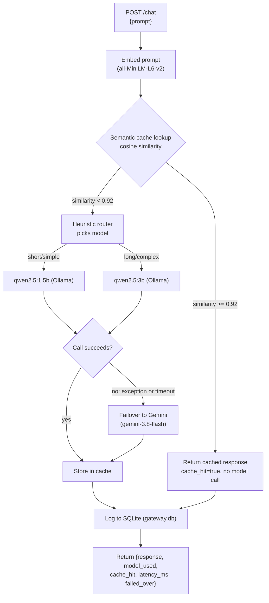

# LLM Gateway MVP

A local LLM gateway that routes prompts between two Ollama models by a heuristic, caches semantically similar prompts, and fails over to Gemini if the local model call fails.

## What this is

This is a single FastAPI endpoint (`POST /chat`) sitting in front of two Ollama models running on my own machine: a small one (`qwen2.5:1.5b`) for simple prompts and a bigger one (`qwen2.5:3b`) for longer or more complex ones. Before calling either, it checks a semantic cache so a near-duplicate of a prompt it's already answered doesn't trigger another model call. If the routed local call fails or times out, it retries the same request against Gemini instead of just erroring out. Every request — hit, miss, or failover — gets logged to SQLite, so the numbers in this README come from querying that log, not from memory.

## Why I built this

Most of the LLM-adjacent projects I've built (and seen other students build) are about what the model itself produces — a chatbot, a summarizer, something prompt-engineered. This one is about the layer underneath that: given more than one model to call, how do you decide which one handles a request, how do you avoid paying for the same generation twice, and what do you do when the thing you're calling doesn't answer. That's a different skill set from prompt work, closer to the serving/infrastructure side of ML systems, and I wanted something concrete to point to for it — an actual gateway I ran real requests through and can explain constant-by-constant, not a diagram of one I intend to build.

## Architecture



Cache hits skip the model call entirely and go straight to the log. Cache misses go through the router, then Ollama, and only touch Gemini if that Ollama call actually fails — Gemini is never a routing option the heuristic picks on its own. Every path, hit or miss, ends up logged before the response goes back.

## Quick start

Tested on Windows with Python 3.13. On Mac/Linux, swap `venv\Scripts\...` for `venv/bin/...` and `copy` for `cp`.

**1. Install [Ollama](https://ollama.com) and pull both models this gateway routes between:**
```bash
ollama pull qwen2.5:1.5b
ollama pull qwen2.5:3b
```
Ollama should end up running on its default port (`localhost:11434`) — `ollama list` should show both models pulled.

**2. Clone this repo and set up a virtual environment:**
```bash
git clone https://github.com/amanjuneja420/llm-gateway.git
cd llm-gateway
python -m venv venv
venv\Scripts\pip install -r requirements.txt
```

**3. (Optional — only needed for Gemini failover) set up your API key:**
```bash
copy .env.example .env
```
Edit `.env` and put a real Gemini API key in place of `your_key_here`. Without this, everything else works exactly the same — a failed local call just fails outright (with a clear "GEMINI_API_KEY is not set" error) instead of successfully failing over.

**4. Start the gateway:**
```bash
venv\Scripts\python -m uvicorn main:app --port 8000
```
First startup takes ~20–25 seconds while the embedding model loads into memory. Leave this running in its own terminal.

**5. In a second terminal, run the benchmark:**
```bash
venv\Scripts\python benchmark.py
```
This fires 30 prompts at the running server and prints a summary: cache hit rate, average latency for hits vs. misses, and latency broken down by model. This is the script the numbers in "Results & verification" below actually came from.

**6. (Optional) Verify the Gemini failover path:**
```bash
venv\Scripts\python test_failover.py
```

**7. (Optional) Deeper analysis, once `gateway.db` has some data in it:**
```bash
venv\Scripts\python analyze_ollama_stats.py       # load-time vs. generation-time breakdown per model
venv\Scripts\python aggregate_benchmark_runs.py   # combine multiple benchmark runs into one table
```

## Project structure

- [`main.py`](main.py) — the FastAPI app: `POST /chat`, wires together the router, cache, Ollama calls, and Gemini failover
- [`router.py`](router.py) — the heuristic model router (no I/O, pure function)
- [`cache.py`](cache.py) — the semantic cache (embedding + cosine similarity)
- [`db.py`](db.py) — SQLite schema + logging helper
- [`benchmark.py`](benchmark.py) — standalone load/test script, run manually against the live server
- [`test_failover.py`](test_failover.py) — standalone test script for the Gemini failover path
- [`analyze_ollama_stats.py`](analyze_ollama_stats.py) — breaks down Ollama's own load/eval timing per model from `gateway.db`
- [`aggregate_benchmark_runs.py`](aggregate_benchmark_runs.py) — combines several `benchmark.py` runs' printed summaries into one table with min/max/avg speedup and hit rate
- `runs/` — raw `gateway.db` snapshot from each `benchmark.py` run (`gateway_run_<UTC timestamp>.db`), archived automatically before the next run wipes the live `gateway.db`
- `gateway.db` — the committed SQLite log; currently a reference snapshot from one full benchmark run (Run 3, see below), kept so the results below are re-derivable rather than just asserted
- `.env` (not committed — see `.env.example`) — holds `GEMINI_API_KEY`, loaded at startup via `python-dotenv`

## Design decisions

### The routing heuristic — and why it's a heuristic, not a trained model

`router.py` decides which model handles a prompt using two cheap, fully inspectable signals computed directly on the prompt text — no model, no training data, no learned weights:

1. **Word count** — prompts longer than `WORD_COUNT_THRESHOLD = 20` words are treated as "long" and routed to the bigger model. 20 was chosen by eyeballing example prompts: it's roughly where a prompt stops being a single simple question and becomes a paragraph-style, multi-clause request.
2. **Complexity keywords** — a fixed set (`explain`, `compare`, `contrast`, `steps`, `why`, `how does`, `difference between`, `pros and cons`, `analyze`, `summarize`, `evaluate`) that correlate with multi-step or open-ended reasoning tasks, catching short-but-hard prompts like "Why is the sky blue?" that word count alone would miss.

If either signal fires, the prompt goes to `qwen2.5:3b`; otherwise `qwen2.5:1.5b`.

**Why a heuristic instead of a trained classifier:** given the time I had, a heuristic is instant to run (no inference cost of its own), fully transparent (every routing decision can be explained by pointing at the exact line of code that made it), and needs zero training data or evaluation harness to trust. A trained router could route more accurately in principle, but that requires labeled examples of which model *should* have handled a given prompt, plus its own accuracy evaluation — infrastructure I didn't have time to build for this pass. The honest framing: I used an explicit heuristic and can justify every constant in it; a trained router would be the natural next iteration if I had labeled routing data to train it on.

### The semantic cache and its similarity threshold

`cache.py` embeds every prompt with `sentence-transformers/all-MiniLM-L6-v2`, keeps all `(embedding, prompt, response, model_used)` tuples in a plain Python list (no FAISS, no vector DB), and on each new prompt computes cosine similarity against every cached embedding with a single numpy dot product (embeddings are stored pre-normalized, so cosine similarity is just a dot product). If the best match scores at or above `SIMILARITY_THRESHOLD = 0.92`, that cached response is returned instantly and no model call is made.

**How 0.92 was chosen:** measured directly, not guessed. Using this exact embedding model:

| Prompt pair | Cosine similarity |
|---|---|
| "What is the capital of France?" vs "What's France's capital city?" (paraphrase) | 0.944 |
| "What is the capital of France?" vs "Can you tell me the capital of France" (paraphrase) | 0.934 |
| "What is the capital of France?" vs "What is the population of France?" (related, different question) | 0.709 |
| "What is the capital of France?" vs "What is the capital of Germany?" (related, different answer) | 0.663 |
| "What is the capital of France?" vs "How do I bake sourdough bread?" (unrelated) | 0.133 |

Genuine paraphrases land in the 0.93–0.95 range; the nearest "related but actually a different question" pairs land around 0.66–0.71. 0.92 sits comfortably in the gap between those two clusters — high enough that a subtly different question (different country, different attribute) won't incorrectly hit the cache, low enough that real paraphrasing reliably hits. It's a single named constant at the top of `cache.py`, so it's trivial to retune if more data suggests otherwise.

### What counts as a "failure" for Gemini failover

The two Ollama models are the primary backends; Gemini is a fallback for when the routed local call fails, not a third option the router ever picks directly.

In `chat()`, the call to `call_ollama()` is wrapped in a bare `except Exception`. This catches everything the local call can throw, including:
- A timeout past `OLLAMA_TIMEOUT_SECONDS = 120.0` (the same constant `call_ollama`'s own `httpx.AsyncClient` already uses for its timeout — failover reuses it rather than introducing a second threshold to reason about). httpx raises `ConnectTimeout` or `ReadTimeout` here.
- A connection failure (Ollama not running, wrong port, refused connection) — `httpx.ConnectError`.
- An HTTP error status from Ollama itself (`resp.raise_for_status()` raising `HTTPStatusError` on a 4xx/5xx).
- Any other exception the call raises — on the theory that "local call didn't produce a usable response" should fail over regardless of the exact exception type.

On any of the above, the *same request* is immediately retried against `GEMINI_MODEL` (currently `gemini-3.8-flash` — see the incident note under "Results & verification" for why not the originally planned `gemini-1.5-flash`). The response comes back normally, with `model_used` set to the Gemini model name and `failed_over: true` on `ChatResponse`. `db.py` logs `failed_over` as its own column, so failovers are queryable after the fact, not just visible in the moment.

**This is deliberately not a circuit breaker.** There's no failure counter, no open/half-open/closed state, no cooldown window before trying Ollama again. Every request independently tries the local model first; only that one request's failure decides whether it falls back to Gemini. If Ollama recovers a millisecond later, the very next request goes straight back to it. A real circuit breaker (trip after N consecutive failures, stop even trying the local model for a cooldown period, half-open probe requests) is more machinery than I built here — see "Known limitations" below.

**On the API key:** `call_gemini()` sends `GEMINI_API_KEY` as the `x-goog-api-key` HTTP header, never as a URL query parameter. httpx exceptions (and anything that logs them) include the request URL in their message — a key-in-URL would leak the secret into ordinary error output the moment a Gemini call ever failed. A header never appears in that message.

## Results & verification

### Benchmark: 5 independent runs

The cache-hit speedup multiplier turned out to vary noticeably run-to-run on this shared, CPU-only machine (778x in the first clean run, 400x in a later one) — that's background CPU load changing the *absolute* miss latency, not noise in the cache itself (hit latency stays consistently in the tens-to-hundreds of milliseconds regardless of load). Rather than report one cherry-picked number, `benchmark.py` was run 5 separate times, each against a freshly restarted server (empty cache, fresh `gateway.db`, same 30-prompt set every time, `keep_alive: 30m` on every Ollama call so models stay resident):

```
====================================================================================================
                               COMBINED BENCHMARK RESULTS ACROSS RUNS
====================================================================================================
Run                                            n  hit rate   avg hit ms   avg miss ms   speedup
----------------------------------------------------------------------------------------------------
Run A (section 5, first clean run)            30     20.0%         35.3       27489.6    778.7x
Run B (post-instrumentation re-run)           30     20.0%         90.5       36146.5    399.4x
Run 1 (multi-run set)                         30     20.0%         63.0       43214.6    685.9x
Run 2 (multi-run set, 1 request timed out)    29     20.7%         61.3       39310.3    641.3x
Run 3 (multi-run set)                         30     20.0%         91.7       40389.6    440.5x
----------------------------------------------------------------------------------------------------
Speedup (miss/hit) across runs              min=  399.4x   max=  778.7x   avg=  589.2x
Cache hit rate across runs                  min=  20.0%   max=  20.7%   avg=  20.1%
====================================================================================================
```

**Headline result: cache hits were consistently 400x–780x faster than live model generation across 5 runs (average: ~589x).** Cache hit rate was stable at ~20% every time — same 30-prompt set, same 6 intended paraphrase hits; run 2 lost one request to a timeout unrelated to the cache (see below), leaving 29 logged instead of 30, hence 20.7% instead of 20.0%. The exact speedup multiple depends on how loaded the CPU is at the moment (it swings the *miss* latency around, from ~27s to ~43s average across these runs), but the qualitative result — a cache hit costs tens to low-hundreds of milliseconds regardless of load, a real model call costs tens of seconds — held in every single run. This table is reproduced by [`aggregate_benchmark_runs.py`](aggregate_benchmark_runs.py); the 3 newest runs' raw per-request output is in [`benchmark_run_1.log`](benchmark_run_1.log), [`benchmark_run_2.log`](benchmark_run_2.log), [`benchmark_run_3.log`](benchmark_run_3.log).

**Incident: a benchmark run crashed, so I hardened the script.** Running the batch 5 times instead of once surfaced a real gap: on a sufficiently loaded run, a single `qwen2.5:3b` call can exceed `main.py`'s own 120s httpx timeout to Ollama and return a 500 — this happened at request 23 of run 2. The first version of `benchmark.py` had no error handling around its request loop, so this single failed request killed the entire 30-prompt run partway through. I added a try/except around each request that logs a `FAIL` line and moves on instead of crashing — a gap that only showed up because I ran the batch repeatedly, not on the first pass.

### Detail from the most recent single run (Run 3)

```
============================================================
                     BENCHMARK SUMMARY
============================================================
Total requests                                            30
Cache hits                                                 6
Cache misses                                              24
Cache hit rate                                         20.0%
------------------------------------------------------------
Avg latency - cache hits                            91.7 ms
Avg latency - cache misses                       40389.6 ms
Speedup (miss / hit)                                 440.3x
------------------------------------------------------------
Avg latency by model_used:
  cache                      n=6     avg=      91.7 ms
  qwen2.5:1.5b               n=11    avg=    3386.1 ms
  qwen2.5:3b                 n=13    avg=   71700.3 ms
============================================================
```

Takeaways that held across every run, not just this one:

- **Routing worked as designed**: short/simple prompts consistently went to `qwen2.5:1.5b` (low single-digit seconds), longer/keyword-bearing prompts to `qwen2.5:3b` (tens of seconds to over a minute) — an order-of-magnitude latency difference between the two models on this CPU, which is exactly the cost the router exists to manage (don't pay the 3b tax for "What is 15 times 7?").
- **Not every paraphrase hit** — e.g. "How does photosynthesis work?" and "What's the highest mountain on Earth?" scored below 0.92 against their near-duplicate and fell through to a real model call, in every run. This is expected and, if anything, reassuring: 0.92 is a deliberately conservative threshold that favors correctness over maximizing hit rate — see the similarity table above for the actual gap it's tuned against.
- Absolute latencies vary run-to-run on a shared CPU — background load on the machine matters more than anything in the gateway's own code. The routing split and the cache speedup range are what generalize; a single run's raw milliseconds don't, which is why the range across 5 runs is the headline number, not one run.

### Is the 3b model slow because of reload overhead, or genuinely slow generation?

Ollama's `/api/generate` response includes `load_duration` (time spent loading the model into memory), `eval_count` (tokens generated), and `eval_duration` (time spent generating those tokens) — all in nanoseconds except `eval_count`. `main.py` extracts these on every real model call and logs them to `gateway.db` as `load_duration_ms`, `eval_count`, and `eval_duration_ms` (NULL on cache hits and on failover, since no local model call was made either way). [`analyze_ollama_stats.py`](analyze_ollama_stats.py) queries this and breaks it down per model — numbers below are from Run 3:

```
==============================================================================
        OLLAMA TIMING BREAKDOWN (cache misses only - real model calls)
==============================================================================

Model: qwen2.5:1.5b   (n=11 requests)
  avg total latency_ms                     3386.1
  avg load_duration_ms                        7.8
  avg eval_count (tokens)                    35.7
  avg eval_duration_ms                     1824.2
  tokens/sec                                19.59
  load_duration / latency                    0.2%
  eval_duration / latency                   53.9%

Model: qwen2.5:3b   (n=13 requests)
  avg total latency_ms                    71700.3
  avg load_duration_ms                       11.1
  avg eval_count (tokens)                   592.8
  avg eval_duration_ms                    69811.7
  tokens/sec                                 8.49
  load_duration / latency                    0.0%
  eval_duration / latency                   97.4%
==============================================================================
```

**Answer: it's genuinely slow generation, not reload overhead — consistently, across runs.** `load_duration_ms` is under 12ms on average for both models in every run checked so far — under 0.2% of total latency — meaning `keep_alive` is working and the model isn't being unloaded/reloaded between requests. Essentially all of the wall-clock time (54–63% for 1.5b, 97%+ for 3b — the remainder is Ollama's own prompt-eval time plus network/HTTP overhead not captured here) is `eval_duration`: actual token-by-token generation. The 3b model also runs at roughly half the throughput of the 1.5b model (~8–10 vs. ~20–22 tokens/sec across runs) and tends to generate longer responses for this prompt set — both effects compound, which is why 3b's average latency is so much higher and so much more variable run-to-run. This is the expected shape for CPU-only inference on integrated graphics: no GPU to parallelize matrix multiplies, so generation speed scales with parameter count and response length, not with how often the model gets swapped in and out of memory.

### Gemini failover: test evidence

[`test_failover.py`](test_failover.py) imports `main.py` directly (no live server needed) so it can monkeypatch `main.OLLAMA_URL` to an unreachable port for exactly one call, simulating a local failure without touching the real Ollama service. Real output from an actual run — the script never prints the API key, so there's nothing redacted here:

```
=== Test 1: normal request through Ollama (should be unaffected) ===
PASS - model_used=qwen2.5:1.5b  cache_hit=False  failed_over=False  latency_ms=1283.1

=== Test 2: simulated local failure -> Gemini failover ===
Ollama call failed (ConnectError: All connection attempts failed) - failing over to Gemini
PASS - model_used=gemini-3.8-flash  failed_over=True  latency_ms=5629.9
Gemini response (truncated): 'Europa'

=== Verifying failed_over=1 was actually logged to gateway.db ===
PASS - row id=34  model_used=gemini-3.8-flash  failed_over=1  latency_ms=5629.9  prompt='Name one moon of Jupiter, for the failover test.'

============================================================
FAILOVER TEST SUMMARY
============================================================
  PASS   normal request
  PASS   gemini failover
  PASS   db logging
============================================================
```

**Incident: the model I'd planned to use didn't exist anymore.** This test didn't pass on the first try. The first run correctly detected the simulated failure and correctly attempted failover, but failed at the last step with `GEMINI_API_KEY is not set` — there was no `.env` yet, which is itself useful evidence that the failure-detection logic works independently of whether Gemini succeeds. The second run, still targeting the originally planned `gemini-1.5-flash`, got as far as a real HTTP call to Gemini and back a `404 Not Found` — that model has since been deprecated. I confirmed this by querying `GET /v1beta/models` for the actual key and finding `gemini-1.5-flash` absent from the list of models it could use, then picked `gemini-3.8-flash` from what was actually available. Only after that switch did the full path succeed end to end. I'm including all three states here instead of just the final passing one, because a debugging path that actually happened is better evidence than a clean run that skips it.

## Known limitations

- **Runs A, B, 1, and 2 have no preserved raw database.** The archiving mechanism (`runs/gateway_run_<timestamp>.db`) didn't exist yet when those benchmark runs were executed, so their numbers in the table above are transcribed from that session's printed summaries/logs, not re-derivable from a raw `gateway.db`. Run 3's raw data happened to still be sitting in `gateway.db` when the archiving script was added, so it was copied into `runs/` retroactively — Runs A, B, 1, and 2 never will be. Every run from here on is fully re-derivable from raw per-request rows, including the Ollama timing instrumentation, not just a printed summary.
- **Everything was measured on one CPU-only machine** (Intel integrated graphics, no CUDA). The routing split and cache speedup direction should generalize; the absolute millisecond numbers are specific to this hardware and clearly move around with background load even on this one machine (see the 400x–780x spread above).
- **The router is a heuristic, not a trained model** — by design for this pass, but it means routing accuracy has a ceiling that a learned router, given labeled data, could probably beat.
- **The semantic cache is in-memory and resets on every server restart.** There's no persistence layer for it — a redeploy or crash means starting from an empty cache again.
- **No rate limiting.** Nothing stops one client from firing requests as fast as the CPU (or Gemini's own rate limits) will allow.
- **The Gemini failover is a simple retry, not a circuit breaker** — no failure counter, no cooldown, no half-open state (see "Design decisions" above). It only ever reacts to the one request in front of it.
- **No Docker, Kubernetes, or deployment/CI-CD setup**, and no load balancing across multiple local model replicas. These were left out deliberately rather than forgotten — this was a time-boxed solo project, and I don't have hands-on deployment experience I could back up in an interview yet if asked to defend those choices.

## What I'd build next

- Rate limiting
- SSE streaming for the `/chat` response
- A trained routing classifier, once I have labeled data on which model actually handled a given prompt best
- A small dashboard over `gateway.db` instead of querying it by hand
