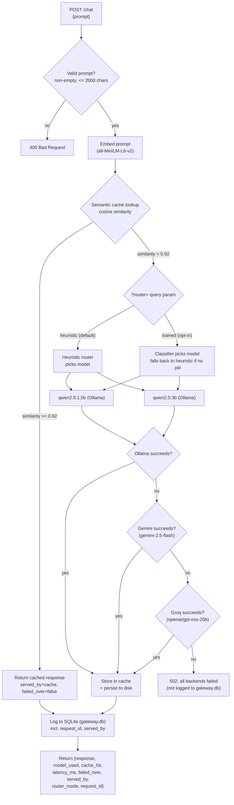

# LLM Gateway MVP

A local LLM gateway that routes prompts between two Ollama models by a heuristic, caches semantically similar prompts, and fails over through Gemini and then Groq if the local model call fails.

## What this is

This is a FastAPI gateway (`POST /chat`, plus a streaming `POST /chat/stream`) sitting in front of two Ollama models running on my own machine: a small one (`qwen2.5:1.5b`) for simple prompts and a bigger one (`qwen2.5:3b`) for longer or more complex ones. Before calling either, it checks a semantic cache so a near-duplicate of a prompt it's already answered doesn't trigger another model call. If the routed local call fails or times out, it retries through a chain of cloud fallbacks — Gemini, then Groq — instead of just erroring out. Every request — hit, miss, or failover — gets logged to SQLite with a per-request ID, so the numbers in this README come from querying that log, not from memory. There's also a `GET /health` endpoint, basic input validation, per-client rate limiting, a cache that survives a restart, a genuinely-concurrent load test that found and documents a real race condition, and a read-only Streamlit dashboard over the request log.

## Why I built this

Most of the LLM-adjacent projects I've built (and seen other students build) are about what the model itself produces — a chatbot, a summarizer, something prompt-engineered. This one is about the layer underneath that: given more than one model to call, how do you decide which one handles a request, how do you avoid paying for the same generation twice, and what do you do when the thing you're calling doesn't answer. That's a different skill set from prompt work, closer to the serving/infrastructure side of ML systems, and I wanted something concrete to point to for it — an actual gateway I ran real requests through and can explain constant-by-constant, not a diagram of one I intend to build.

## Architecture



Cache hits skip the model call entirely and go straight to the log. Cache misses go through the router, then a three-tier failover chain — Ollama first, then Gemini, then Groq — stopping at the first success; Gemini and Groq are never routing options the heuristic picks on its own, only fallbacks for when Ollama's call actually fails. Every successful path, hit or miss, ends up logged before the response goes back; a request where all three backends fail is the one path that returns without being logged (see "Known limitations"). `GET /health` is a separate, lightweight endpoint that checks reachability of all three backends without going through any of this.

`POST /chat/stream` follows the same cache check and rate limiting shown above, but diverges after a cache miss: it talks to Ollama directly with token streaming instead of entering the failover chain, and it doesn't support `?router=trained` — see "SSE streaming" under "Results & verification" for why it's scoped narrower than `/chat` on purpose, not left out of this diagram by oversight.

## Quick start

Tested on Windows with Python 3.13. On Mac/Linux, swap `venv\Scripts\...` for `venv/bin/...` and `copy` for `cp`.

**1. Install [Ollama](https://ollama.com) and pull both models this gateway routes between:**
```bash
ollama pull qwen2.5:1.5b
ollama pull qwen2.5:3b
```
Ollama should end up running on its default port (`localhost:11434`) — `ollama list` should show both models pulled.

**2. Clone this repo and set up a virtual environment:**
```bash
git clone https://github.com/amanjuneja420/llm-gateway.git
cd llm-gateway
python -m venv venv
venv\Scripts\pip install -r requirements.txt
```

**3. (Optional — only needed for cloud failover) set up API keys:**
```bash
copy .env.example .env
```
Edit `.env` and put real `GEMINI_API_KEY` / `GROQ_API_KEY` values in place of the placeholders. Without either, everything else works exactly the same — a failed local call just fails outright at that tier (with a clear "API_KEY is not set" error) instead of successfully failing over.

**4. Start the gateway:**
```bash
venv\Scripts\python -m uvicorn main:app --port 8000
```
First startup takes ~20–25 seconds while the embedding model loads into memory (and, if a cache was previously saved, while it's reloaded from disk). Leave this running in its own terminal. `curl http://localhost:8000/health` is a quick way to confirm all three backends are reachable.

**5. In a second terminal, run the benchmark:**
```bash
venv\Scripts\python benchmark.py
```
This fires 30 prompts at the running server and prints a summary: cache hit rate, average latency for hits vs. misses, and latency broken down by model. This is the script the numbers in "Results & verification" below actually came from.

**6. (Optional) Verify the failover chain:**
```bash
venv\Scripts\python test_failover.py
```
Covers a normal Ollama request, a cache hit, Ollama-fails-to-Gemini, and Ollama+Gemini-fail-to-Groq — see "Results & verification" for real output.

**7. (Optional) Verify rate limiting:**
```bash
venv\Scripts\python test_rate_limit.py
```
Finishes in a few seconds — it swaps in a fast test-only limiter rather than waiting out the production 60-second window.

**7b. (Optional, slow — a few minutes on CPU) run the concurrent load test:**
```bash
venv\Scripts\python load_test.py
```
Fires genuinely concurrent requests (not sequential, unlike `benchmark.py`) to surface race conditions in the cache and rate limiter, plus real throughput/latency under concurrency — see "Real concurrent load test" under "Results & verification". Archives and restores `gateway.db` automatically, same pattern as `benchmark.py`.

**7c. (Optional) try streaming:**
```bash
venv\Scripts\python test_streaming.py
```
Sends a real prompt to `POST /chat/stream` and prints each token as it arrives with a timestamp, then repeats the same prompt to show the cache-hit path — see "SSE streaming" under "Results & verification".

**8. (Optional) Deeper analysis, once `gateway.db` has some data in it:**
```bash
venv\Scripts\python analyze_ollama_stats.py       # load-time vs. generation-time breakdown per model
venv\Scripts\python aggregate_benchmark_runs.py   # combine multiple benchmark runs into one table
venv\Scripts\python cost_estimate.py              # what this token volume would cost on paid APIs
```

**9. (Optional, slow — ~35 minutes on CPU, and skippable — see warning) generate the router evaluation set:**
```bash
venv\Scripts\python generate_eval_set.py
```
Runs 50 prompts through both models directly (bypassing the router) and writes `eval_set.csv` for manual quality judging — see "Results & verification". **Skip this step on a fresh clone unless you intend to redo the manual judging yourself**: the committed `eval_set.csv` already has real `which_is_better` judgments in it (that's what step 10 below actually trains on), and this script opens its output file in `"w"` mode — running it overwrites those judgments with a fresh, empty-`which_is_better` file, unrecoverable unless you `git checkout eval_set.csv` afterward.

**10. Train and evaluate the routing classifier** on the already-judged `eval_set.csv` (no need to run step 9 first — the judgments are already committed):
```bash
venv\Scripts\python train_classifier.py
```
Prints cross-validated accuracy and a heuristic-vs-classifier comparison, and saves `router_classifier.pkl`. Once that file exists, `POST /chat?router=trained` opts a request into the trained router instead of the default heuristic — see "Trained routing classifier" under "Results & verification" for why the heuristic stays the default.

**11. (Optional) view the dashboard:**
```bash
venv\Scripts\streamlit run dashboard.py
```
Opens at `http://localhost:8501`. Reads `gateway.db` directly — the gateway server doesn't need to be running.

## Project structure

- [`main.py`](main.py) — the FastAPI app: `POST /chat`, `POST /chat/stream`, `GET /health`, request validation, request-ID tracing, rate limiting, and the failover chain, all wired together
- [`backends.py`](backends.py) — the `Backend` interface (`generate(prompt) -> BackendResponse`) and its three implementations: `OllamaBackend`, `GeminiBackend`, `GroqBackend`
- [`rate_limiter.py`](rate_limiter.py) — the token-bucket rate limiter, one bucket per client key
- [`router.py`](router.py) — the heuristic model router (no I/O, pure function)
- [`cache.py`](cache.py) — the semantic cache (embedding + cosine similarity + disk persistence)
- [`db.py`](db.py) — SQLite schema + logging helper
- [`benchmark.py`](benchmark.py) — standalone load/test script, run manually against the live server (sequential by design)
- [`load_test.py`](load_test.py) — genuinely concurrent load test (`asyncio.gather`), built to surface race conditions and real throughput/latency under concurrency, not just sequential numbers
- [`test_failover.py`](test_failover.py) — standalone test script for the full three-tier failover chain
- [`test_streaming.py`](test_streaming.py) — real client test for `POST /chat/stream`, timestamping every SSE chunk to confirm tokens actually arrive incrementally
- [`test_rate_limit.py`](test_rate_limit.py) — standalone test script for the rate limiter (unit-level + endpoint wiring)
- [`analyze_ollama_stats.py`](analyze_ollama_stats.py) — breaks down Ollama's own load/eval timing per model from `gateway.db`, explicitly excluding (and reporting the count of) any Gemini/Groq failover rows a miss-only query would otherwise mis-attribute as Ollama timing
- [`aggregate_benchmark_runs.py`](aggregate_benchmark_runs.py) — combines several `benchmark.py` runs' printed summaries into one table with min/max/avg speedup and hit rate
- [`cost_estimate.py`](cost_estimate.py) — estimates what this project's real token volume would have cost on paid hosted APIs, versus $0 for local Ollama calls
- [`generate_eval_set.py`](generate_eval_set.py) — router evaluation harness: runs 50 prompts through both local models directly and writes [`eval_set.csv`](eval_set.csv) for manual quality judging (generation only — it does not judge)
- [`train_classifier.py`](train_classifier.py) — trains and cross-validates a routing classifier on the hand-judged `eval_set.csv`, compares it against `router.py`'s heuristic, and saves [`router_classifier.pkl`](router_classifier.pkl)
- [`dashboard.py`](dashboard.py) — read-only Streamlit dashboard over `gateway.db`: request volume, model usage, cache hit rate, latency by model
- `runs/` — raw `gateway.db` snapshots archived automatically before something else would overwrite the live `gateway.db`: `gateway_run_<timestamp>.db` from `benchmark.py`, `gateway_load_test_<timestamp>.db` from `load_test.py` (which also restores the clean Run 3 snapshot afterward — see "Real concurrent load test")
- `gateway.db` — the committed SQLite log; currently a reference snapshot from one full benchmark run (Run 3, see below), kept so the results below are re-derivable rather than just asserted
- `.env` (not committed — see `.env.example`) — holds `GEMINI_API_KEY` and `GROQ_API_KEY`, loaded at startup via `python-dotenv`
- `cache_state.npz` / `cache_state.json` (not committed) — the semantic cache's persisted state, written after every new entry and reloaded on startup

## Design decisions

### The routing heuristic — and why it's a heuristic, not a trained model

`router.py` decides which model handles a prompt using two cheap, fully inspectable signals computed directly on the prompt text — no model, no training data, no learned weights:

1. **Word count** — prompts longer than `WORD_COUNT_THRESHOLD = 20` words are treated as "long" and routed to the bigger model. 20 was chosen by eyeballing example prompts: it's roughly where a prompt stops being a single simple question and becomes a paragraph-style, multi-clause request.
2. **Complexity keywords** — a fixed set (`explain`, `compare`, `contrast`, `steps`, `why`, `how does`, `difference between`, `pros and cons`, `analyze`, `summarize`, `evaluate`) that correlate with multi-step or open-ended reasoning tasks, catching short-but-hard prompts like "Why is the sky blue?" that word count alone would miss.

If either signal fires, the prompt goes to `qwen2.5:3b`; otherwise `qwen2.5:1.5b`.

**Why a heuristic instead of a trained classifier:** given the time I had, a heuristic is instant to run (no inference cost of its own), fully transparent (every routing decision can be explained by pointing at the exact line of code that made it), and needs zero training data or evaluation harness to trust. A trained router could route more accurately in principle, but that requires labeled examples of which model *should* have handled a given prompt, plus its own accuracy evaluation. I've since built and run that full path — see "Trained routing classifier (experimental, opt-in only)" under "Results & verification" for the real numbers — and the honest result is that ~49 labeled examples wasn't enough for it to actually beat this heuristic. The heuristic stays the default; the trained classifier is available as an explicit opt-in, not a replacement.

### The semantic cache, its similarity threshold, and persistence

`cache.py` embeds every prompt with `sentence-transformers/all-MiniLM-L6-v2`, keeps all `(embedding, prompt, response, model_used)` tuples in a plain Python list (no FAISS, no vector DB), and on each new prompt computes cosine similarity against every cached embedding with a single numpy dot product (embeddings are stored pre-normalized, so cosine similarity is just a dot product). If the best match scores at or above `SIMILARITY_THRESHOLD = 0.92`, that cached response is returned instantly and no model call is made.

**How 0.92 was chosen:** measured directly, not guessed. Using this exact embedding model:

| Prompt pair | Cosine similarity |
|---|---|
| "What is the capital of France?" vs "What's France's capital city?" (paraphrase) | 0.944 |
| "What is the capital of France?" vs "Can you tell me the capital of France" (paraphrase) | 0.934 |
| "What is the capital of France?" vs "What is the population of France?" (related, different question) | 0.709 |
| "What is the capital of France?" vs "What is the capital of Germany?" (related, different answer) | 0.663 |
| "What is the capital of France?" vs "How do I bake sourdough bread?" (unrelated) | 0.133 |

Genuine paraphrases land in the 0.93–0.95 range; the nearest "related but actually a different question" pairs land around 0.66–0.71. 0.92 sits comfortably in the gap between those two clusters — high enough that a subtly different question (different country, different attribute) won't incorrectly hit the cache, low enough that real paraphrasing reliably hits. It's a single named constant at the top of `cache.py`, so it's trivial to retune if more data suggests otherwise.

**The gap isn't as clean for every paraphrase, though - a real finding from `benchmark.py`'s own prompt set, not from the table above.** Four of its intended paraphrase pairs score *below* 0.92 in practice and consistently miss the cache in every real run (confirmed against `benchmark_run_1.log`/`benchmark_run_3.log` and re-measured directly): "remote work pros/cons" at 0.874, "tallest/highest mountain" at 0.898, and two photosynthesis phrasings at 0.9149 and 0.9169 — the last two close enough to the threshold that a small wording change could flip them either way. These are genuine near-paraphrases that simply don't clear the bar, not a labeling mistake about which prompts were meant to pair with which (`benchmark.py`'s comments used to claim all of these should hit; they're now corrected to say so explicitly, with the measured score, rather than left wrong). Left as real misses rather than reworded to force a hit: they're accurate evidence of exactly where 0.92 draws the line on real paraphrase variation, and changing the wording now would make future benchmark runs incomparable to the 5 already reported below. This doesn't change any previously-reported number — the actual prompt strings were never wrong, only their comments were, and comments don't affect what the gateway ran.

**Persistence:** `SemanticCache.save()`/`load()` write/read `cache_state.npz` (the embeddings, stacked into one matrix) and `cache_state.json` (the parallel prompt/response/model_used lists) — plain numpy and stdlib `json`, deliberately not `pickle`, since a corrupted or tampered pickle file can execute arbitrary code on load and these formats can't. The cache loads on startup and saves immediately after every new entry, not only on a clean shutdown — cross-process graceful shutdown signaling turned out to be unreliable on Windows during testing, and a shutdown-only save would lose everything on a crash anyway, which is the case that matters most. There's no size cap or eviction policy: it grows for as long as the process runs (see "Known limitations").

`save()` is `async` - it turned out that "rewriting the whole file after every new entry is cheap enough not to matter for latency" (this project's own original assumption) wasn't true: `np.savez()`/`json.dump()` are blocking file I/O, and calling them directly on the event loop stalls *every* other in-flight coroutine for however long the write takes, not just the request that triggered it. `save()` now snapshots the data to write synchronously first (cheap - a numpy stack and three list copies, no I/O, and since nothing in that snapshot step awaits anything, no other coroutine can mutate the cache mid-snapshot), then hands the actual disk writes to a worker thread via `asyncio.to_thread()` - every entry still gets persisted immediately (the crash-durability guarantee above is unchanged), just without blocking the loop while it happens.

### Backend failover chain: Ollama → Gemini → Groq

The gateway tries three backends in a fixed order, stopping at the first success. `backends.py` defines a common `Backend` interface — `generate(prompt) -> BackendResponse` — implemented by `OllamaBackend`, `GeminiBackend`, and `GroqBackend`, so `main.py`'s `chat()` can loop over them without caring which one is actually answering beyond the name it reports back. This was originally two separate functions (`call_ollama()`, `call_gemini()`) directly in `main.py`; pulling them behind one interface was a deliberate refactor, done and verified as behavior-preserving *before* Groq was added on top of it.

**What counts as a "failure":** each tier's `generate()` call is wrapped in a bare `except Exception`, covering a timeout past that backend's own configured timeout, a connection failure, an HTTP error status, or anything else the call raises — "didn't produce a usable response" fails over regardless of the exact exception type. `OLLAMA_TIMEOUT_SECONDS = 120.0` is both the local timeout and, functionally, the original failover trigger threshold from before Groq existed.

**`served_by`** (`"ollama"` / `"gemini"` / `"groq"` / `"cache"`) records which backend actually answered a given request, logged as its own `gateway.db` column. `failed_over` is kept alongside it for backward compatibility with the simpler two-tier framing this started as — it's explicitly `served_by in ("gemini", "groq")`, true only when an actual backend failover occurred, and false for both `"ollama"` and `"cache"` (a cache hit is the healthy fast path, not a failover, and that's set explicitly rather than left to a default — see Phase 2's bug notes below for why that distinction mattered).

**This is deliberately not a circuit breaker.** There's no failure counter, no open/half-open/closed state, no cooldown window before trying Ollama again. Every request independently tries the local model first, then Gemini, then Groq; only that one request's own failures decide how far down the chain it falls. If Ollama recovers a millisecond later, the very next request goes straight back to it. A real circuit breaker (trip after N consecutive failures, stop even trying earlier tiers for a cooldown period, half-open probe requests) is more machinery than I built here — see "Known limitations".

**Why Groq, and why `openai/gpt-oss-20b` specifically:** Groq was queried live (`GET /openai/v1/models`) rather than assuming a model name — the list included speech-to-text and TTS models, input classifiers, Groq's own agentic `compound`/`compound-mini` wrapper (excluded: it can invoke tools on its own, unpredictable for a plain completions call), Qwen and Arabic-focused models, and the `openai/gpt-oss-*` family. `gpt-oss-20b` is the smallest/fastest plain instruction model in the list — this tier only gets exercised after Ollama *and* Gemini have both already failed for a request, so low latency matters more here than anywhere else in the chain. A real test call returned in ~39ms server-side.

**On API keys:** `GeminiBackend` sends its key via the `x-goog-api-key` header and `GroqBackend` via a `Bearer` token in `Authorization` — never as a URL query parameter for either. httpx exceptions (and anything that logs them) include the request URL in their message; a key-in-URL would leak the secret into ordinary error output the moment a call to that backend ever failed. A header never appears in that message.

**Connection reuse:** each backend instance holds one shared `httpx.AsyncClient` across its whole lifetime (constructed once in `__init__`, closed via `aclose()` in `main.py`'s `lifespan()` on shutdown) rather than opening a brand-new client - and paying for a fresh TCP/TLS handshake - on every single `generate()` call. `self.base_url`/`self.url` are still read fresh per call from the instance, not baked into the client, so `test_failover.py`'s runtime monkeypatching of those attributes to simulate a failure still works exactly as before - verified by re-running it after this change (6/6 checks still pass, including both real induced failovers).

## Results & verification

### Benchmark results (5 independent runs)

The cache-hit speedup multiplier turned out to vary noticeably run-to-run on this shared, CPU-only machine (778x in the first clean run, 400x in a later one) — that's background CPU load changing the *absolute* miss latency, not noise in the cache itself (hit latency stays consistently in the tens-to-hundreds of milliseconds regardless of load). To report an honest number instead of cherry-picking one run, `benchmark.py` was run 5 separate times, each against a freshly restarted server (empty cache, fresh `gateway.db`, same 30-prompt set every time, `keep_alive: 30m` on every Ollama call so models stay resident):

```
====================================================================================================
                               COMBINED BENCHMARK RESULTS ACROSS RUNS
====================================================================================================
Run                                            n  hit rate   avg hit ms   avg miss ms   speedup
----------------------------------------------------------------------------------------------------
Run A (section 5, first clean run)            30     20.0%         35.3       27489.6    778.7x
Run B (post-instrumentation re-run)           30     20.0%         90.5       36146.5    399.4x
Run 1 (multi-run set)                         30     20.0%         63.0       43214.6    685.9x
Run 2 (multi-run set, 1 request timed out)    29     20.7%         61.3       39310.3    641.3x
Run 3 (multi-run set)                         30     20.0%         91.7       40389.6    440.5x
----------------------------------------------------------------------------------------------------
Speedup (miss/hit) across runs              min=  399.4x   max=  778.7x   avg=  589.2x
Cache hit rate across runs                  min=  20.0%   max=  20.7%   avg=  20.1%
====================================================================================================
```

**Headline result: cache hits were consistently 400x-780x faster than live model generation across 5 runs (average: ~589x).** Cache hit rate was stable at ~20% every time (the same 30-prompt set with the same 6 intended paraphrase hits; run 2 lost one request to a timeout unrelated to the cache — see below — leaving 29 logged instead of 30, hence 20.7% instead of 20.0%). The exact speedup multiple depends on how loaded the CPU is at the moment (it swings the *miss* latency around, from ~27s to ~43s average across these runs) but the qualitative result — a cache hit costs tens to low-hundreds of milliseconds regardless of load, a real model call costs tens of seconds — held in every single run. This table is reproduced by [`aggregate_benchmark_runs.py`](aggregate_benchmark_runs.py); the 3 newest runs' raw per-request output is in [`benchmark_run_1.log`](benchmark_run_1.log), [`benchmark_run_2.log`](benchmark_run_2.log), [`benchmark_run_3.log`](benchmark_run_3.log).

One robustness issue surfaced by running the batch 5 times instead of once: on a sufficiently loaded run, a single `qwen2.5:3b` call can exceed `main.py`'s own 120s httpx timeout to Ollama (run 2, request 23) and return a 500. `benchmark.py` catches this per-request and logs a `FAIL` line instead of crashing the whole batch — a real gap this repeated-run exercise caught that a single run wouldn't have.

**Known limitation on reproducibility, stated plainly rather than hidden:** the archiving mechanism (`runs/gateway_run_<timestamp>.db`) didn't exist yet when Runs A, B, 1, 2, and 3 were executed, so all five are transcribed from that session's printed summaries/logs rather than re-derivable from a preserved raw `gateway.db`. Run 3's raw data happened to still be sitting in `gateway.db` (nothing had wiped it yet) when the archiving script was added, so it was copied into `runs/` retroactively as `gateway_run_20260907T125043Z.db` — Runs A, B, 1, and 2 have no raw snapshot and never will. From the *next* `benchmark.py` invocation onward, the script copies `gateway.db` to `runs/gateway_run_<UTC timestamp>.db` itself immediately after printing its summary, before the next run's fresh restart wipes it — so every run from Run 3 onward is fully re-derivable from raw per-request rows (including the `load_duration_ms` / `eval_count` / `eval_duration_ms` instrumentation), not just its printed summary. See "Known limitations" below for the same point stated in that section's own words.

### Phase 1: health endpoint, request tracing, input validation, cache persistence

**`GET /health`** checks Ollama (a lightweight `/api/tags` call, not a generation) and each cloud backend (a models-list call) without touching the cache, router, or DB. The three checks run concurrently (`asyncio.gather`), not one after another - each has its own 5-second timeout, so a sequential worst case (all three actually timing out) took up to 15 seconds for one `/health` call; concurrently, the same worst case takes ~5 seconds instead. Real output with all three backends up:
```
{"gateway":"up","ollama":"up","gemini":"up","groq":"up","cache_size":0}
```

**Request tracing:** a UUID (`request_id`) is generated once per request and threaded through the cache lookup, the failover chain, any `print()` emitted along the way, the DB row, and the response — the same value end to end. Verified for real: a request's `request_id` in its JSON response matched its `gateway.db` row exactly (`id=31`, same UUID, same prompt and model).

**Input validation:** an empty/whitespace-only prompt returns `400 {"detail":"prompt must not be empty or whitespace-only"}`; a prompt over `MAX_PROMPT_LENGTH = 2000` chars returns `400 {"detail":"prompt exceeds MAX_PROMPT_LENGTH (2000 chars)"}`. Both confirmed live against the running server.

**Cache persistence, tested against an actual crash, not just a clean restart:** sent a request, confirmed `cache_state.npz`/`.json` appeared on disk immediately, then **force-killed** the server process (simulating a crash, not a graceful shutdown) and restarted it. Startup log: `Loaded 1 cache entries from disk (cache_state.json/.npz)`. A paraphrase of the original prompt then returned `cache_hit: true` on the freshly restarted process — `model_used=cache, latency_ms=98.97` — with no new model call, proving the cache genuinely survived the restart rather than just the file existing.

### Phase 2: three-tier failover chain, and two real bugs it caught

[`test_failover.py`](test_failover.py) imports `main.py` directly (no live server needed) and monkeypatches specific backend instances' URLs to simulate failures without touching the real services. Real output from an actual run, covering all three tiers plus the cache-hit case:

```
=== Test 1: normal request through Ollama (should be unaffected) ===
PASS - model_used=qwen2.5:1.5b  cache_hit=False  served_by=ollama  failed_over=False  latency_ms=1936.4

=== Test: cache hit reports failed_over=False (it's the healthy fast path) ===
PASS - cache_hit=True  served_by=cache  failed_over=False  latency_ms=97.9

=== Test 2: Ollama fails -> Gemini succeeds ===
PASS - model_used=gemini-2.5-flash  served_by=gemini  failed_over=True  latency_ms=5415.7

=== Verifying served_by='gemini' was actually logged to gateway.db (test 2) ===
PASS - row id=34  model_used=gemini-2.5-flash  served_by=gemini  failed_over=1  latency_ms=5415.7

=== Test 3: Ollama AND Gemini both fail -> Groq succeeds ===
PASS - model_used=openai/gpt-oss-20b  served_by=groq  failed_over=True  latency_ms=7387.4

=== Verifying served_by='groq' was actually logged to gateway.db (test 3) ===
PASS - row id=35  model_used=openai/gpt-oss-20b  served_by=groq  failed_over=1  latency_ms=7387.4

============================================================
FAILOVER TEST SUMMARY
============================================================
  PASS   normal request (ollama)
  PASS   cache hit not failed_over
  PASS   gemini failover
  PASS   db logging (gemini)
  PASS   groq failover
  PASS   db logging (groq)
============================================================
```

The all-three-fail path was also verified manually: pointing all three backends at unreachable addresses for one request returned a clean `502` — `"All backends failed for this request: ollama (ConnectError); gemini (ConnectError); groq (ConnectError)"` — instead of a crash, with no `gateway.db` row written (see "Known limitations").

**Two real bugs this phase caught, not hypothetical ones:**
1. **The interface refactor silently broke the existing test's monkeypatch.** Before Groq was added, `call_ollama()`/`call_gemini()` were pulled into `backends.py`'s `OllamaBackend`/`GeminiBackend` as a "pure" refactor. `test_failover.py` used to simulate a failure by setting `main.OLLAMA_URL` to an unreachable address — after the refactor, that constant is only read once, at construction, by each `OllamaBackend` instance, so patching it afterward silently did nothing. Caught by actually re-running the existing tests before adding Groq, as planned, rather than assuming a "pure" refactor needed no re-verification. Fixed by patching the specific backend instance's `base_url` attribute instead.
2. **Schema migration only ran inside FastAPI's `lifespan`.** `init_db()`'s non-destructive `ALTER TABLE` migrations (for columns like `served_by`) normally run at server startup - but `test_failover.py` imports `main.py` directly and never triggers uvicorn's ASGI lifecycle, so the migration never ran and the first test run failed with `no column named served_by`. Fixed by having the test call `init_db()` itself, which is the more robust fix anyway: a test environment shouldn't depend on a real server having run first to have the right schema.

### Phase 3: cost estimation

[`cost_estimate.py`](cost_estimate.py) sums `eval_count` (tokens generated) across `gateway.db` and estimates what that volume would have cost on two reference paid APIs, versus the $0 this project actually paid running locally. Real output against the committed Run 3 snapshot:
```
Total tokens generated (eval_count)                      8,100
  served by local Ollama (actual cost: $0)               8,100
  served by cloud failover (Gemini/Groq)                     0
----------------------------------------------------------------
If ALL of this volume had instead gone to a paid API:

  OpenAI GPT-5.6 Luna                       $   0.0097
  Anthropic Claude Haiku 4.5                $   0.0405

  Local Ollama (what actually happened)     $   0.0000
```

**Both originally-planned reference models turned out to be stale when checked against live pricing pages**, the same "verify, don't assume" lesson as the Gemini/Groq model selections above: `GPT-4o-mini` no longer appears in OpenAI's pricing tables at all (only a passing legacy footnote), replaced with `GPT-5.6 Luna` — the cheapest model in OpenAI's current flagship table (source: `developers.openai.com`, checked 2026-09-08). `Claude Haiku 3.5` is listed on Anthropic's own pricing page as "retired, except on Bedrock and Google Cloud", replaced with the current `Claude Haiku 4.5` (source: `platform.claude.com/en/docs/about-claude/pricing`, checked 2026-09-08). This is explicitly a hardcoded, illustrative snapshot, not a live pricing integration — it will go stale again, and only accounts for output-token cost since `gateway.db` never logs prompt/input token counts, so it's a floor on the real bill, not a full one.

### Phase 4: router evaluation harness (generation step)

[`generate_eval_set.py`](generate_eval_set.py) bypasses `router.py` entirely and runs both `qwen2.5:1.5b` and `qwen2.5:3b` directly on the same 50 prompts — 20 deduplicated unique questions from `benchmark.py`'s 30-prompt set (its paraphrase groups exist to test the cache, not model quality, so only one phrasing per question was kept) plus 30 new prompts spanning domains `benchmark.py` doesn't touch (math, biology, CS/data structures, economics, literature). Output is [`eval_set.csv`](eval_set.csv): `prompt`, `response_1.5b`, `response_3b`, and an empty `which_is_better` column.

Real evidence from an actual run, in [`eval_generation.log`](eval_generation.log): all 50 prompts × 2 models = 100 real generations succeeded (zero errors), taking **34.7 minutes (2081s) total** on this CPU-only machine — individual `qwen2.5:3b` calls ran up to 103 seconds. Confirmed before committing: `which_is_better` is empty on all 50 rows at this stage. This script only generates — judging which model answered better, by hand, was separate work, done afterward and used to train an actual routing classifier on top of it — see "Trained routing classifier (experimental, opt-in only)" below.

### Rate limiting

[`rate_limiter.py`](rate_limiter.py) is a token bucket per client key, checked at the very start of `chat()` before anything else runs (cache lookup, routing, validation, all of it). The client key comes from an `X-API-Key` header — not validated against any real authentication, this is rate limiting only, not auth — with no header at all bucketed under `"anonymous"`. Default: `RATE_LIMIT_REQUESTS = 10` requests per `RATE_LIMIT_WINDOW_SECONDS = 60` seconds, both named constants in `main.py`. A bucket starts full (an immediate burst up to 10 is allowed) and refills continuously rather than resetting on a fixed clock boundary. Over the limit returns `429` with a `Retry-After` header; nothing is logged to `gateway.db` for a rate-limited request, the same as a `400` or the all-backends-failed `502`.

[`test_rate_limit.py`](test_rate_limit.py) is split into two parts on purpose: real Ollama latency (1–4+ seconds per call, sometimes much more - see the benchmark results above) is too slow and variable to reliably test *burst* behavior by firing several real requests back to back and assuming near-zero elapsed time between them, so the token-bucket algorithm itself is tested in isolation first (no model calls, fully deterministic), then the endpoint wiring is confirmed separately with only 2 real calls. Real output from an actual run:

```
=== Part 1: RateLimiter/TokenBucket in isolation (no model calls) ===
  [1/3] PASS - allowed (within capacity)
  [2/3] PASS - allowed (within capacity)
  [3/3] PASS - allowed (within capacity)
  PASS - rejected over capacity, retry_after=1.00s
  Waiting 3.5s for the window to reset...
  PASS - allowed again after the window reset

=== Part 2: confirm main.chat() actually enforces this (2 real model calls) ===
Firing 1 real request against an already-drained bucket (should be rejected)...
  PASS - got 429, Retry-After='1', detail='Rate limit exceeded: 3 requests per 3s per X-API-Key. Retry after 1s.'
Waiting 3.5s for the window to reset...
Firing 1 more real request (after reset - should succeed)...
  PASS - succeeded again (model_used=qwen2.5:1.5b)

============================================================
RATE LIMIT TEST SUMMARY
============================================================
  PASS   token bucket (unit, isolated)
  PASS   chat() endpoint enforcement (real requests)
============================================================
```

The test swaps in a smaller/faster limiter (3 requests / 3 seconds instead of production's 10/60) so it finishes in seconds — the 429 message above correctly reports `3 requests per 3s` because it reads `capacity`/`window_seconds` off whichever `RateLimiter` instance is actually live, not off the module-level defaults, a real bug the first version of this test caught (the message used to always say "10 requests per 60s" regardless of which limiter was actually enforcing the check).

**A real interaction worth knowing about:** [`benchmark.py`](benchmark.py) sends no `X-API-Key` header, so all 30 of its requests share the single `"anonymous"` bucket. At the default 10/60s, a fresh benchmark run can burn through the initial 10-request burst well within a minute and start hitting `429`s partway through. `benchmark.py`'s own per-request error handling (see the timeout/`FAIL`-line note under "Benchmark results (5 independent runs)" above) will catch these as `FAIL` lines and keep going rather than crash, but the resulting hit-rate/latency numbers from a fresh run would no longer match the 5-run table above without either raising the limit, giving the benchmark its own header, or exempting it. Not fixed here since it wasn't asked for — flagged so a future re-run's numbers aren't a surprise.

### Real concurrent load test

Every other test script in this project (`benchmark.py`, `test_failover.py`, `test_rate_limit.py`'s Part 2) sends requests one at a time, deliberately - see `benchmark.py`'s own docstring on why. [`load_test.py`](load_test.py) is the exception: it fires genuinely concurrent requests via `asyncio.gather()` over one shared `httpx.AsyncClient`, specifically to answer questions a sequential test can't ask - does the semantic cache's `find()`-then-`add()` sequence race under real concurrency, does the rate limiter's token bucket hold up, and what does this CPU-only, single-Ollama-instance gateway actually do under concurrent load.

Two waves, each internally concurrent (everything in a wave fires at the same instant via one `asyncio.gather`):

- **Wave 1 (14 requests at once):** two duplicate-prompt groups - 4 exact copies of `"What is the capital of Italy?"`, and 4 already-validated paraphrases of `"What is the capital of Japan?"` (`benchmark.py`'s own "group A", confirmed there to reliably hit the cache sequentially) - plus 6 distinct routing-mix prompts (5 simple, 1 complex; capped at one complex prompt so a slow 3b call under contention couldn't stretch the wave out or risk tripping `OLLAMA_TIMEOUT_SECONDS`).
- **Wave 2 (15 requests at once):** 15 distinct, short, keyword-free prompts (all route to `qwen2.5:1.5b`), all under one client key, sized to exceed `RATE_LIMIT_REQUESTS=10` on purpose.

**Finding 1 — the semantic cache has a real, 100% reproducible race under concurrency, not a hypothetical one.** Both duplicate groups scored zero hits:
```
Group 'exact duplicate' (4 concurrent identical requests): 0 hits, 4 misses
Group 'paraphrase'      (4 concurrent identical requests): 0 hits, 4 misses
```
`chat()` calls `cache.find()`, `await`s the backend call (40-100+ seconds under this test's contention), then calls `cache.add()`. Under concurrency, all 4 identical requests call `find()` and get a miss before any one of them has finished its backend call and reached `add()` - the race window (an entire generation) is vastly larger than the gap between the 4 requests' arrivals (milliseconds), so at this concurrency level the race isn't an edge case, it's the deterministic outcome. 8 requests that should have produced 2 real model calls + 6 near-instant hits instead produced 8 real model calls. **This means the cache-hit-latency-under-concurrency comparison this test was designed to make couldn't be made from this run** - there were zero concurrent hits to measure, and that absence is itself the finding, not a gap in the test.

**Finding 2 — the rate limiter's own logic is race-free, confirmed by inspection and matched by the numbers, but a request rejected by it doesn't come back instantly under load.** `RateLimiter.check()` is a plain synchronous function with no `await` in it, called from a single-process asyncio event loop - no other coroutine can interleave between reading and updating a bucket's token count, so double-counted or lost tokens aren't possible here regardless of concurrency. Wave 2's result: **11 succeeded (200), 4 rejected (429)** against a capacity of 10 - not exactly a 10/5 split, because the bucket refills continuously (`capacity / window_seconds` tokens/sec) and enough time passed between the first and last request actually being *checked* (not sent - see below) for one extra token to regenerate; the 11th accepted request was the very last one in the batch, consistent with it being checked several seconds after the first ten. What's worth flagging honestly: the 4 rejected requests took **~8.8 seconds** of client-observed wall-clock time to come back with their 429, not the near-instant response you'd expect from a synchronous check running before anything else in `chat()`. The rate limiter's *logic* isn't the cause (verified above); the likely cause is queueing/scheduling delay elsewhere in the concurrent request path on this single-process event loop, but that wasn't root-caused further here - flagged as an open observation rather than asserted with more confidence than the evidence supports.

**Finding 3 — Ollama re-paid a ~16-second model-load cost on every one of the 13 concurrent `qwen2.5:1.5b` calls in Wave 1, then paid under 100ms on all 11 in Wave 2.** `gateway.db`'s `load_duration_ms` column (Ollama's own self-reported load time, already used elsewhere in this README - see Phase 3/4) tells this story directly:
```
Wave 1 (13 concurrent 1.5b calls): load_duration_ms ≈ 16,000-16,124ms on EVERY one
Wave 2 (11 concurrent 1.5b calls, sent ~100s later): load_duration_ms ≈ 22-71ms on EVERY one
```
`OllamaBackend` passes `keep_alive="30m"` on every request specifically to keep a model resident between calls (see `backends.py`), so this isn't a cold-start cost paid once - it was paid **13 times**, once per concurrent request, in the same wave. By Wave 2, with the model apparently settled from Wave 1's contention, all 11 concurrent calls loaded near-instantly. The most likely explanation is that simultaneous requests to the same model destabilize whatever Ollama does to keep it resident on this CPU-only setup - but the exact internal mechanism wasn't dug into further, so this is reported as observed behavior, not a root-caused explanation.

**Throughput, latency, and what "concurrent" actually bought here:**
```
Wave 1: 14 requests / 104.5s wall-clock = 0.134 req/s   (sum of individual latencies: 787.2s -> 7.5x "serial equivalent" work in that wall time)
Wave 2: 15 requests / 22.0s wall-clock  = 0.683 req/s   (11 successful / 22.0s = 0.501 req/s)

Client-observed wall-clock latency, all 29 requests: p50=21,950ms  p95=59,901ms  p99=92,050ms
Server-reported latency_ms, 25 successful requests:  p50=37,881ms  p95=54,999ms  p99=87,188ms
```
At n=29 (and n=25), p95/p99 are just the top one or two observations in this specific run, not stable percentiles - stated here as a caveat, not hidden. The more informative comparison is miss latency across contexts: the committed Run 3 snapshot's **sequential** average miss latency (mixed 1.5b/3b) was 40,389.6ms; Wave 1's **concurrent** `qwen2.5:1.5b` misses (paying the ~16s reload tax above) averaged **46,838.5ms** (n=13) - worse than the sequential mixed-model average despite 1.5b normally being much faster than 3b; Wave 2's concurrent `qwen2.5:1.5b` misses (model settled, no reload tax) averaged **8,872.4ms** (n=11) - back in a normal range for this model, if still elevated versus a single sequential call (Phase 2's `test_failover.py` measured 1,936.4ms for one). Concurrency on this CPU-only, single-Ollama-instance setup doesn't parallelize generation - it mostly adds contention.

**Process note:** this run's `gateway.db` was archived to `runs/gateway_load_test_20260909T093848Z.db` and then restored to the clean Run 3 snapshot (this traffic - concurrent duplicates, deliberately-triggered 429s - is adversarial by design, not representative normal traffic, so it doesn't replace Run 3 as the committed baseline). The restore step caught a real bug in its first version: the archived Run 3 snapshot used for restoring predates the `failed_over`/`request_id`/`served_by` column migration, so a naive copy would have silently downgraded `gateway.db`'s schema back to 9 columns. Caught by diffing row content against `git show HEAD:gateway.db` after the first real run, not assumed correct - `load_test.py` now re-runs `db.py`'s migration immediately after restoring, and the restored file is now confirmed byte-identical to the committed one.

**Follow-up rerun, after fixing `cache.save()`'s blocking behavior (see "The semantic cache..." under Design decisions): does that fix explain Finding 2's ~8.8s 429 latency?** Re-ran the full test against the fixed code, same fresh-server/empty-cache setup as the original run. Real result: rejected requests took **~7.6 seconds** this time (7654.7ms, 7646.9ms, 7644.7ms, 7638.5ms) - down from ~8.8s, but not the near-instant response you'd expect if `cache.save()`'s blocking were *the* explanation. The rate limiter's check itself is a synchronous operation that should complete in microseconds; if a blocking `cache.save()` call were the sole cause of the delay, fixing it should have collapsed this number to milliseconds, not shaved off roughly 1 second. **Honest conclusion: this fix does not explain Finding 2's delay** - the most likely remaining candidate is the still-synchronous `sqlite3` `log_request()` write on every successful request (not fixed here, out of this task's scope), but that wasn't proven either; reported as ruled largely out, not confirmed, rather than asserting more than one before/after run of a variable measurement supports.

**A second, unexpected result from the same rerun: Finding 3 (the ~16-second-per-request Ollama reload cost) did not reproduce.** `load_duration_ms` for this run's 13 concurrent `qwen2.5:1.5b` calls ranged from 12ms to 138ms - not the ~16,000ms seen on every one of the original run's 13 calls. The one `qwen2.5:3b` call (first ever in this fresh server session) showed 10,538ms, consistent with a genuine one-time cold load, not the repeated-reload pattern originally reported. This doesn't overturn the original finding (that run's numbers were real, and are reported as measured), but it does mean the ~16s reload behavior isn't a fully deterministic, guaranteed-reproducible property of this setup - it may depend on background system state at the time that wasn't characterized then or now. Flagged honestly as an open question rather than quietly reconciled or dropped.

Both reruns' cache-race and rate-limiter-correctness findings (100% race in both duplicate groups, 11/15 succeeded with a correctly-enforced capacity of 10) reproduced identically to the original run.

### Trained routing classifier (experimental, opt-in only)

[`generate_eval_set.py`](generate_eval_set.py) produced 50 prompts with both models' real responses; I then judged each one by hand, in `eval_set.csv`'s `which_is_better` column, as `"1.5b"`, `"3b"`, `"tie"`, or `"neither"` (neither response was good). [`train_classifier.py`](train_classifier.py) turns that judgment into a routing classifier:

**Methodology:** 1 `"neither"` row was dropped — it carries no signal about which *model* should have handled the prompt, only that both answers were bad. The 20 `"tie"` rows were folded into the `"1.5b"` label rather than dropped or left as a third class — when both models answer equally well, routing's whole point is picking the *minimum sufficient* model, not winning a quality contest, so a tie should route to the cheaper one. That leaves 49 rows: 32 labeled `"1.5b"`, 17 labeled `"3b"`. Each prompt is embedded with the exact same pipeline `cache.py` already uses (`SemanticCache.embed()` — `all-MiniLM-L6-v2`, `normalize_embeddings=True`), so the classifier and the cache are guaranteed to see prompts the same way.

**Real cross-validation output**, 5-fold stratified (49 examples is small enough that a single train/test split would be noise, not a number):
```
  Fold 1/5: accuracy=0.700  (n_test=10)
  Fold 2/5: accuracy=0.700  (n_test=10)
  Fold 3/5: accuracy=0.600  (n_test=10)
  Fold 4/5: accuracy=0.600  (n_test=10)
  Fold 5/5: accuracy=0.667  (n_test=9)

  Mean CV accuracy: 0.653  (std: 0.045)

  Confusion matrix (rows=actual, cols=predicted), aggregated across folds:
               pred 1.5b   pred 3b
  actual 1.5b          32         0
   actual 3b          17         0
```

**The honest finding, not the flattering one:** the confusion matrix shows the classifier predicted `"1.5b"` for every single one of the 49 rows across all folds — zero `"3b"` predictions, ever. The majority-class baseline (always guess `"1.5b"`, learn nothing) is `32/49 = 0.653` — identical to the reported mean CV accuracy to three decimal places. `LogisticRegression`'s default L2 regularization was deliberately left on (49 examples with 384-dim embeddings is a real small-n-large-p regime; disabling it would overfit, not help), and the model still collapsed to the majority class rather than finding a usable signal in the embeddings.

**Plain accuracy alone is the wrong metric here, and using the right one flips the conclusion.** `train_classifier.py` also reports `balanced_accuracy_score` (mean of per-class recall) and a full `classification_report` for both routers, because on a 32/17-imbalanced label set, plain accuracy rewards a model for guessing the majority label correctly without it having learned anything — exactly what happened above.

```
Per-class precision/recall/F1, trained classifier (OOF):
              precision    recall  f1-score   support
        1.5b      0.653     1.000     0.790        32
          3b      0.000     0.000     0.000        17
    accuracy                          0.653        49
   macro avg      0.327     0.500     0.395        49

Per-class precision/recall/F1, heuristic:
              precision    recall  f1-score   support
        1.5b      0.750     0.562     0.643        32
          3b      0.440     0.647     0.524        17
    accuracy                          0.592        49
   macro avg      0.595     0.605     0.583        49
```

**The comparison that actually matters — done side by side, reported whichever way it goes:**
```
  Plain accuracy (misleading here):
    Heuristic router accuracy:               0.592
    Trained classifier accuracy (CV):        0.653  (std: 0.045)
    Majority-class baseline ('always 1.5b'): 0.653

  Balanced accuracy (the fair comparison on this imbalanced set):
    Heuristic balanced accuracy:              0.605
    Trained classifier balanced accuracy:     0.500
```
Plain accuracy says the classifier wins (0.653 vs 0.592). Balanced accuracy says the **opposite** — the heuristic wins (0.605 vs 0.500) — and 0.500 is exactly what a coin flip between the two labels would score. That reversal is the actual finding: the classifier isn't beating the heuristic by routing anything correctly that the heuristic gets wrong; it only looks better on plain accuracy because guessing the majority label happens to score well on a 65/35-imbalanced sample. The heuristic, imperfect as it is, at least tries to identify some "3b" prompts (recall 0.647 on that class) — the classifier never does (recall 0.000). The honest conclusion is that 49 examples was not enough data for logistic regression on sentence embeddings to learn a real routing signal here, not that the classifier is the better router — and balanced accuracy is the metric that actually shows that, rather than requiring a caveat paragraph to explain away a misleading headline number.

**What's shipped as a result, matching that honest conclusion:** the heuristic stays the default. `router_classifier.pkl` (trained on all 49 rows, not held out) is loaded at startup if present, and `POST /chat?router=trained` opts a single request into it — `main.py`'s `route_prompt()` falls back to the heuristic if the pickle file is missing, and the response's `router_mode` field always says which one actually ran. Both are live and comparable side by side; nothing was swapped by default on ~49 labeled examples. Verified end to end against the running server: the same complex prompt routes to `qwen2.5:3b` under the default heuristic and to `qwen2.5:1.5b` under `?router=trained` — consistent with the classifier's majority-class collapse.

### SSE streaming (`/chat/stream`)

Motivated specifically by this being CPU-only hardware, not as a generic feature: a single `qwen2.5:3b` generation can take 60-100+ seconds (measured throughout this README), and waiting that long for one lump JSON response is a materially worse experience than watching tokens arrive as Ollama produces them, even though the total wall-clock time is identical either way. [`main.py`](main.py)'s `chat_stream()` talks to Ollama directly with `"stream": true` (bypassing `backends.py`'s `Backend` abstraction, which returns one complete response and isn't shaped for token-by-token output) and streams back Server-Sent Events - `{"type": "token", "text": "..."}` per chunk, one terminal `{"type": "done", ...}` or `{"type": "error", ...}`.

**What it deliberately does and doesn't do, on purpose:** same rate limiting and input validation as `/chat`, checked before the stream even opens. It *does* check the semantic cache first - a hit streams back as a single token event (the full cached text) then done, essentially instantly, rather than skipping the cache and forcing every repeated prompt through a slow "streamed" re-generation, which would be a real behavior regression against `/chat` on the same gateway. It does **not** fail over to Gemini/Groq on an Ollama failure - falling back mid-stream would mean either buffering the whole cloud response before showing anything (defeating the point) or mixing partial local output with a restarted cloud response, both worse than a clean terminal error event - and it does **not** support `?router=trained`, kept heuristic-only since this endpoint's job is proving out streaming, not re-implementing every `/chat` option.

**Real evidence it actually streams, not just returns the full thing under an SSE wrapper:** [`test_streaming.py`](test_streaming.py) uses httpx's `client.stream()` + `iter_lines()` (deliberately not a plain `client.post()`, which would buffer the whole body and make every chunk look simultaneous) and timestamps every chunk as it arrives:
```
Prompt: "Explain how photosynthesis works in plants, step by step."  (routes to qwen2.5:3b)
  Total tokens received: 747
  Time to first chunk:      3,772.1 ms
  Time to done:            74,418.4 ms
  Inter-chunk gaps:      min=56.2ms  max=325.4ms  avg=94.6ms
  747/747 gaps are > 1ms apart - tokens arrived spread out over real time
```
Every single one of 747 chunks arrived at a measurably later timestamp than the one before it - real incremental delivery, not an artifact of the test. A client watching this stream sees the first word at 3.8 seconds; a client waiting on non-streaming `/chat` for the same generation would see nothing at all until 74.4 seconds.

**The same prompt sent again** (now cached) confirms the cache-check path: one token event carrying the full 3,419-character cached response, `served_by: "cache"`, server-reported `latency_ms: 66.09` - in the same range as this project's other cache hits (Run 3's sequential average: 91.72ms). The test script's own "time to first chunk" for this case shows ~2.6 seconds, but that's the test client's own new-connection overhead on this Windows setup (confirmed separately via `curl -v`, which shows every request trying `[::1]` first and timing out before falling back to `127.0.0.1`), not the gateway's - the `latency_ms` field in the payload is the number that reflects what the gateway itself actually did.

**A second unlogged path, alongside `/chat`'s all-backends-failed 502 (see Known Limitations):** if the client disconnects mid-stream, ASGI tears the generator down via `GeneratorExit` at whichever `yield` it was suspended on, which propagates straight past the cache-write and `log_request()` call at the end of `event_stream()` - a disconnected stream is never cached or logged. This was verified by accident during testing: an early version of `test_streaming.py` crashed mid-stream on a Windows console encoding error partway through receiving a response containing "H₂O", and the gateway's `cache_size` stayed at 0 afterward - exactly the documented behavior, not a bug in the endpoint.

### Read-only dashboard (`dashboard.py`)

[`dashboard.py`](dashboard.py) is a small Streamlit app that reads `gateway.db` directly - no dependency on the gateway server being up, no writes, no new columns. It shows request volume over time (auto-bucketed by minute/hour/day depending on how wide the loaded data's time span actually is), a model usage split, a `served_by` breakdown, cache hit rate, and average latency by model. No new dependencies beyond Streamlit itself, per the brief - `pandas` is imported because Streamlit's own chart functions consume it under the hood, not because this file chose to add a second dependency.

Verified for real against the live server at `localhost:8501` (screenshotted, not just imported and assumed to work), against two different `gateway.db` files:

- **The committed Run 3 snapshot** (30 rows, all predating the `served_by` column): the `served_by breakdown` chart correctly showed 100% of rows as `"not recorded (pre-migration)"`, with an explanatory caption underneath rather than a chart that just looks broken or empty.
- **A mixed file** (the same 30 rows plus 25 real rows from `load_test.py`'s run, which does have `served_by` populated): the chart correctly split into `30 not recorded` / `25 ollama`, and every other chart (volume-over-time bucketing switched automatically from minute to hour once the data spanned almost 2 days, model usage, cache hit rate, latency by model) updated correctly too.

**The "rate-limit rejection count" the brief asked for is always a labeled zero, not a real measurement.** `main.py`'s `chat()` raises the 429 before `log_request()` is ever called - the same reasoning as the all-backends-failed 502 path (see Known Limitations) - so there is no query against `gateway.db` that can recover how many requests were actually rate-limited. The dashboard shows `"0 (by design)"` with a tooltip explaining why, rather than a real-looking `0` that would misleadingly suggest rate limiting never fired (`load_test.py`'s own run triggered 4 real 429s that same day - they just aren't, and can't be, in this table). Getting a real count would mean adding a second logging call to `chat()`'s 429 branch specifically for this dashboard; not done here since it wasn't asked for, flagged instead of silently faked.

## Known limitations

- **A request where all three backends fail is not logged anywhere.** The `502` path in `chat()` returns before calling `log_request()` — confirmed both by code inspection and by a live test with all three backends pointed at unreachable addresses (no `gateway.db` row was written). Every other outcome (cache hit, any successful tier, even a 400 from validation happening before this point) either logs or was never a "the system tried and failed" event in the first place; this one specific path is the exception, stated here rather than implied away.
- **A `/chat/stream` request that disconnects mid-stream is also never logged.** Same reasoning as the point above: `GeneratorExit` tears down the generator before it reaches its own cache-write/`log_request()` call - confirmed by accident during testing (see "SSE streaming" above), not just asserted from reading the code.
- **The semantic cache has a real, 100% reproducible race under concurrency.** `find()`-then-`add()` isn't atomic across the awaited backend call in between, so concurrent identical/near-duplicate requests can all miss before any of them finishes and caches its result - confirmed directly, not hypothesized, by [`load_test.py`](load_test.py) (see "Real concurrent load test" above: both test groups scored 0/4 hits). A per-prompt-hash lock (or a small in-flight-request registry that lets a duplicate arriving mid-flight await the same in-progress call instead of starting its own) would fix this; not built here since this MVP has always run under sequential/low-concurrency demo load, but it's a real gap now that it's been measured, not just theorized.
- **The semantic cache has no size cap or eviction policy.** Persistence (see "Design decisions") means it also no longer resets on restart, which is progress, but the trade-off is that it now grows unbounded for as long as it keeps getting new entries — nothing prunes old or rarely-hit entries.
- **Runs A, B, 1, and 2 (of the original 5-run benchmark set) have no preserved raw database.** The archiving mechanism (`runs/gateway_run_<timestamp>.db`) didn't exist yet when those were executed, so their numbers are transcribed from that session's printed summaries/logs, not re-derivable from a raw `gateway.db`. Every benchmark run from Run 3 onward is fully re-derivable from raw per-request rows instead.
- **Everything was measured on one CPU-only machine** (Intel integrated graphics, no CUDA). The routing split and cache speedup direction should generalize; the absolute millisecond numbers are specific to this hardware and clearly move around with background load even on this one machine (see the benchmark's 400x–780x spread).
- **The router is still a heuristic by default, and the trained alternative doesn't clearly beat it yet.** The full harness now exists end to end — generation, manual judging, cross-validated training, and an opt-in `?router=trained` mode — but at 49 labeled examples the classifier collapsed to a majority-class predictor rather than learning a real signal (see "Trained routing classifier (experimental, opt-in only)" above). More labeled data is the actual next step, not a different model or algorithm.
- **The failover chain is a simple ordered retry, not a circuit breaker** — no failure counter, no cooldown, no half-open state. It only ever reacts to the one request in front of it, at every tier.
- **No Docker, Kubernetes, or deployment/CI-CD setup**, and no load balancing across multiple local model replicas. These were left out deliberately rather than forgotten — this was a time-boxed solo project, and I don't have hands-on deployment experience I could back up in an interview yet if asked to defend those choices.
- **`generate_eval_set.py` has no checkpointing.** All 100 real generations (50 prompts × 2 models, ~35 minutes on CPU) accumulate in an in-memory list, and `eval_set.csv` is only written once, after the very last one finishes. A crash, a killed process, or an Ollama failure at prompt 49 of 50 loses the entire run, not just the unfinished part - there's no incremental per-prompt save to resume from. Left as-is rather than fixed: it has already completed successfully once (see `eval_generation.log`), and periodic checkpointing isn't worth the engineering time against a script that's run once, by hand, not on a schedule.

## What I'd build next

- More labeled routing examples — the real bottleneck for the trained classifier, not a different model or algorithm. A few hundred judged prompts, not 49, is the next thing to try before concluding a learned router can't help here.
- A real fix for the cache's concurrency race (a per-prompt-hash lock, or an in-flight-request registry) — see Known Limitations
- A real rate-limit-rejection count in the dashboard, which means adding a second log call to `chat()`'s 429 branch specifically for it
