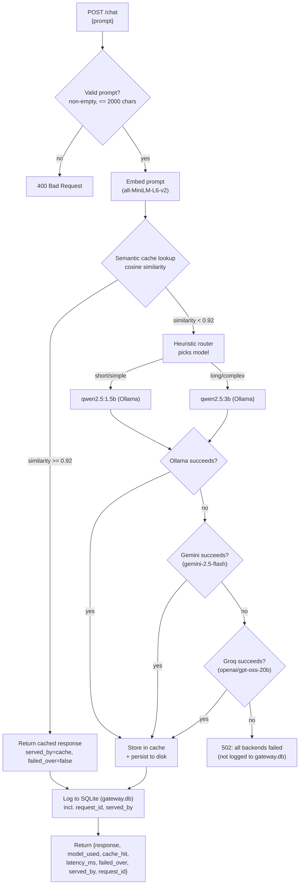

# LLM Gateway MVP

A local LLM gateway that routes prompts between two Ollama models by a heuristic, caches semantically similar prompts, and fails over through Gemini and then Groq if the local model call fails.

## What this is

This is a single FastAPI endpoint (`POST /chat`) sitting in front of two Ollama models running on my own machine: a small one (`qwen2.5:1.5b`) for simple prompts and a bigger one (`qwen2.5:3b`) for longer or more complex ones. Before calling either, it checks a semantic cache so a near-duplicate of a prompt it's already answered doesn't trigger another model call. If the routed local call fails or times out, it retries through a chain of cloud fallbacks — Gemini, then Groq — instead of just erroring out. Every request — hit, miss, or failover — gets logged to SQLite with a per-request ID, so the numbers in this README come from querying that log, not from memory. There's also a `GET /health` endpoint, basic input validation, per-client rate limiting, and a cache that survives a restart.

## Why I built this

Most of the LLM-adjacent projects I've built (and seen other students build) are about what the model itself produces — a chatbot, a summarizer, something prompt-engineered. This one is about the layer underneath that: given more than one model to call, how do you decide which one handles a request, how do you avoid paying for the same generation twice, and what do you do when the thing you're calling doesn't answer. That's a different skill set from prompt work, closer to the serving/infrastructure side of ML systems, and I wanted something concrete to point to for it — an actual gateway I ran real requests through and can explain constant-by-constant, not a diagram of one I intend to build.

## Architecture



Cache hits skip the model call entirely and go straight to the log. Cache misses go through the router, then a three-tier failover chain — Ollama first, then Gemini, then Groq — stopping at the first success; Gemini and Groq are never routing options the heuristic picks on its own, only fallbacks for when Ollama's call actually fails. Every successful path, hit or miss, ends up logged before the response goes back; a request where all three backends fail is the one path that returns without being logged (see "Known limitations"). `GET /health` is a separate, lightweight endpoint that checks reachability of all three backends without going through any of this.

## Quick start

Tested on Windows with Python 3.13. On Mac/Linux, swap `venv\Scripts\...` for `venv/bin/...` and `copy` for `cp`.

**1. Install [Ollama](https://ollama.com) and pull both models this gateway routes between:**
```bash
ollama pull qwen2.5:1.5b
ollama pull qwen2.5:3b
```
Ollama should end up running on its default port (`localhost:11434`) — `ollama list` should show both models pulled.

**2. Clone this repo and set up a virtual environment:**
```bash
git clone https://github.com/amanjuneja420/llm-gateway.git
cd llm-gateway
python -m venv venv
venv\Scripts\pip install -r requirements.txt
```

**3. (Optional — only needed for cloud failover) set up API keys:**
```bash
copy .env.example .env
```
Edit `.env` and put real `GEMINI_API_KEY` / `GROQ_API_KEY` values in place of the placeholders. Without either, everything else works exactly the same — a failed local call just fails outright at that tier (with a clear "API_KEY is not set" error) instead of successfully failing over.

**4. Start the gateway:**
```bash
venv\Scripts\python -m uvicorn main:app --port 8000
```
First startup takes ~20–25 seconds while the embedding model loads into memory (and, if a cache was previously saved, while it's reloaded from disk). Leave this running in its own terminal. `curl http://localhost:8000/health` is a quick way to confirm all three backends are reachable.

**5. In a second terminal, run the benchmark:**
```bash
venv\Scripts\python benchmark.py
```
This fires 30 prompts at the running server and prints a summary: cache hit rate, average latency for hits vs. misses, and latency broken down by model. This is the script the numbers in "Results & verification" below actually came from.

**6. (Optional) Verify the failover chain:**
```bash
venv\Scripts\python test_failover.py
```
Covers a normal Ollama request, a cache hit, Ollama-fails-to-Gemini, and Ollama+Gemini-fail-to-Groq — see "Results & verification" for real output.

**7. (Optional) Verify rate limiting:**
```bash
venv\Scripts\python test_rate_limit.py
```
Finishes in a few seconds — it swaps in a fast test-only limiter rather than waiting out the production 60-second window.

**7b. (Optional, slow — a few minutes on CPU) run the concurrent load test:**
```bash
venv\Scripts\python load_test.py
```
Fires genuinely concurrent requests (not sequential, unlike `benchmark.py`) to surface race conditions in the cache and rate limiter, plus real throughput/latency under concurrency — see "Real concurrent load test" under "Results & verification". Archives and restores `gateway.db` automatically, same pattern as `benchmark.py`.

**8. (Optional) Deeper analysis, once `gateway.db` has some data in it:**
```bash
venv\Scripts\python analyze_ollama_stats.py       # load-time vs. generation-time breakdown per model
venv\Scripts\python aggregate_benchmark_runs.py   # combine multiple benchmark runs into one table
venv\Scripts\python cost_estimate.py              # what this token volume would cost on paid APIs
```

**9. (Optional, slow — ~35 minutes on CPU) generate the router evaluation set:**
```bash
venv\Scripts\python generate_eval_set.py
```
Runs 50 prompts through both models directly (bypassing the router) and writes `eval_set.csv` for manual quality judging — see "Results & verification".

**10. (Optional) Train and evaluate the routing classifier**, once `eval_set.csv`'s `which_is_better` column is filled in by hand:
```bash
venv\Scripts\python train_classifier.py
```
Prints cross-validated accuracy and a heuristic-vs-classifier comparison, and saves `router_classifier.pkl`. Once that file exists, `POST /chat?router=trained` opts a request into the trained router instead of the default heuristic — see "Trained routing classifier" under "Results & verification" for why the heuristic stays the default.

## Project structure

- [`main.py`](main.py) — the FastAPI app: `POST /chat`, `GET /health`, request validation, request-ID tracing, and the failover chain, all wired together
- [`backends.py`](backends.py) — the `Backend` interface (`generate(prompt) -> BackendResponse`) and its three implementations: `OllamaBackend`, `GeminiBackend`, `GroqBackend`
- [`rate_limiter.py`](rate_limiter.py) — the token-bucket rate limiter, one bucket per client key
- [`router.py`](router.py) — the heuristic model router (no I/O, pure function)
- [`cache.py`](cache.py) — the semantic cache (embedding + cosine similarity + disk persistence)
- [`db.py`](db.py) — SQLite schema + logging helper
- [`benchmark.py`](benchmark.py) — standalone load/test script, run manually against the live server (sequential by design)
- [`load_test.py`](load_test.py) — genuinely concurrent load test (`asyncio.gather`), built to surface race conditions and real throughput/latency under concurrency, not just sequential numbers
- [`test_failover.py`](test_failover.py) — standalone test script for the full three-tier failover chain
- [`test_rate_limit.py`](test_rate_limit.py) — standalone test script for the rate limiter (unit-level + endpoint wiring)
- [`analyze_ollama_stats.py`](analyze_ollama_stats.py) — breaks down Ollama's own load/eval timing per model from `gateway.db`
- [`aggregate_benchmark_runs.py`](aggregate_benchmark_runs.py) — combines several `benchmark.py` runs' printed summaries into one table with min/max/avg speedup and hit rate
- [`cost_estimate.py`](cost_estimate.py) — estimates what this project's real token volume would have cost on paid hosted APIs, versus $0 for local Ollama calls
- [`generate_eval_set.py`](generate_eval_set.py) — router evaluation harness: runs 50 prompts through both local models directly and writes [`eval_set.csv`](eval_set.csv) for manual quality judging (generation only — it does not judge)
- [`train_classifier.py`](train_classifier.py) — trains and cross-validates a routing classifier on the hand-judged `eval_set.csv`, compares it against `router.py`'s heuristic, and saves [`router_classifier.pkl`](router_classifier.pkl)
- `runs/` — raw `gateway.db` snapshot from each `benchmark.py` run (`gateway_run_<UTC timestamp>.db`), archived automatically before the next run wipes the live `gateway.db`
- `gateway.db` — the committed SQLite log; currently a reference snapshot from one full benchmark run (Run 3, see below), kept so the results below are re-derivable rather than just asserted
- `.env` (not committed — see `.env.example`) — holds `GEMINI_API_KEY` and `GROQ_API_KEY`, loaded at startup via `python-dotenv`
- `cache_state.npz` / `cache_state.json` (not committed) — the semantic cache's persisted state, written after every new entry and reloaded on startup

## Design decisions

### The routing heuristic — and why it's a heuristic, not a trained model

`router.py` decides which model handles a prompt using two cheap, fully inspectable signals computed directly on the prompt text — no model, no training data, no learned weights:

1. **Word count** — prompts longer than `WORD_COUNT_THRESHOLD = 20` words are treated as "long" and routed to the bigger model. 20 was chosen by eyeballing example prompts: it's roughly where a prompt stops being a single simple question and becomes a paragraph-style, multi-clause request.
2. **Complexity keywords** — a fixed set (`explain`, `compare`, `contrast`, `steps`, `why`, `how does`, `difference between`, `pros and cons`, `analyze`, `summarize`, `evaluate`) that correlate with multi-step or open-ended reasoning tasks, catching short-but-hard prompts like "Why is the sky blue?" that word count alone would miss.

If either signal fires, the prompt goes to `qwen2.5:3b`; otherwise `qwen2.5:1.5b`.

**Why a heuristic instead of a trained classifier:** given the time I had, a heuristic is instant to run (no inference cost of its own), fully transparent (every routing decision can be explained by pointing at the exact line of code that made it), and needs zero training data or evaluation harness to trust. A trained router could route more accurately in principle, but that requires labeled examples of which model *should* have handled a given prompt, plus its own accuracy evaluation. I've since built and run that full path — see "Trained routing classifier (experimental)" under "Results & verification" for the real numbers — and the honest result is that ~49 labeled examples wasn't enough for it to actually beat this heuristic. The heuristic stays the default; the trained classifier is available as an explicit opt-in, not a replacement.

### The semantic cache, its similarity threshold, and persistence

`cache.py` embeds every prompt with `sentence-transformers/all-MiniLM-L6-v2`, keeps all `(embedding, prompt, response, model_used)` tuples in a plain Python list (no FAISS, no vector DB), and on each new prompt computes cosine similarity against every cached embedding with a single numpy dot product (embeddings are stored pre-normalized, so cosine similarity is just a dot product). If the best match scores at or above `SIMILARITY_THRESHOLD = 0.92`, that cached response is returned instantly and no model call is made.

**How 0.92 was chosen:** measured directly, not guessed. Using this exact embedding model:

| Prompt pair | Cosine similarity |
|---|---|
| "What is the capital of France?" vs "What's France's capital city?" (paraphrase) | 0.944 |
| "What is the capital of France?" vs "Can you tell me the capital of France" (paraphrase) | 0.934 |
| "What is the capital of France?" vs "What is the population of France?" (related, different question) | 0.709 |
| "What is the capital of France?" vs "What is the capital of Germany?" (related, different answer) | 0.663 |
| "What is the capital of France?" vs "How do I bake sourdough bread?" (unrelated) | 0.133 |

Genuine paraphrases land in the 0.93–0.95 range; the nearest "related but actually a different question" pairs land around 0.66–0.71. 0.92 sits comfortably in the gap between those two clusters — high enough that a subtly different question (different country, different attribute) won't incorrectly hit the cache, low enough that real paraphrasing reliably hits. It's a single named constant at the top of `cache.py`, so it's trivial to retune if more data suggests otherwise.

**Persistence:** `SemanticCache.save()`/`load()` write/read `cache_state.npz` (the embeddings, stacked into one matrix) and `cache_state.json` (the parallel prompt/response/model_used lists) — plain numpy and stdlib `json`, deliberately not `pickle`, since a corrupted or tampered pickle file can execute arbitrary code on load and these formats can't. The cache loads on startup and saves immediately after every new entry, not only on a clean shutdown — cross-process graceful shutdown signaling turned out to be unreliable on Windows during testing, and a shutdown-only save would lose everything on a crash anyway, which is the case that matters most. There's no size cap or eviction policy: it grows for as long as the process runs (see "Known limitations").

### Backend failover chain: Ollama → Gemini → Groq

The gateway tries three backends in a fixed order, stopping at the first success. `backends.py` defines a common `Backend` interface — `generate(prompt) -> BackendResponse` — implemented by `OllamaBackend`, `GeminiBackend`, and `GroqBackend`, so `main.py`'s `chat()` can loop over them without caring which one is actually answering beyond the name it reports back. This was originally two separate functions (`call_ollama()`, `call_gemini()`) directly in `main.py`; pulling them behind one interface was a deliberate refactor, done and verified as behavior-preserving *before* Groq was added on top of it.

**What counts as a "failure":** each tier's `generate()` call is wrapped in a bare `except Exception`, covering a timeout past that backend's own configured timeout, a connection failure, an HTTP error status, or anything else the call raises — "didn't produce a usable response" fails over regardless of the exact exception type. `OLLAMA_TIMEOUT_SECONDS = 120.0` is both the local timeout and, functionally, the original failover trigger threshold from before Groq existed.

**`served_by`** (`"ollama"` / `"gemini"` / `"groq"` / `"cache"`) records which backend actually answered a given request, logged as its own `gateway.db` column. `failed_over` is kept alongside it for backward compatibility with the simpler two-tier framing this started as — it's explicitly `served_by in ("gemini", "groq")`, true only when an actual backend failover occurred, and false for both `"ollama"` and `"cache"` (a cache hit is the healthy fast path, not a failover, and that's set explicitly rather than left to a default — see Phase 2's bug notes below for why that distinction mattered).

**This is deliberately not a circuit breaker.** There's no failure counter, no open/half-open/closed state, no cooldown window before trying Ollama again. Every request independently tries the local model first, then Gemini, then Groq; only that one request's own failures decide how far down the chain it falls. If Ollama recovers a millisecond later, the very next request goes straight back to it. A real circuit breaker (trip after N consecutive failures, stop even trying earlier tiers for a cooldown period, half-open probe requests) is more machinery than I built here — see "Known limitations".

**Why Groq, and why `openai/gpt-oss-20b` specifically:** Groq was queried live (`GET /openai/v1/models`) rather than assuming a model name — the list included speech-to-text and TTS models, input classifiers, Groq's own agentic `compound`/`compound-mini` wrapper (excluded: it can invoke tools on its own, unpredictable for a plain completions call), Qwen and Arabic-focused models, and the `openai/gpt-oss-*` family. `gpt-oss-20b` is the smallest/fastest plain instruction model in the list — this tier only gets exercised after Ollama *and* Gemini have both already failed for a request, so low latency matters more here than anywhere else in the chain. A real test call returned in ~39ms server-side.

**On API keys:** `GeminiBackend` sends its key via the `x-goog-api-key` header and `GroqBackend` via a `Bearer` token in `Authorization` — never as a URL query parameter for either. httpx exceptions (and anything that logs them) include the request URL in their message; a key-in-URL would leak the secret into ordinary error output the moment a call to that backend ever failed. A header never appears in that message.

## Results & verification

### Phase 1: health endpoint, request tracing, input validation, cache persistence

**`GET /health`** checks Ollama (a lightweight `/api/tags` call, not a generation) and each cloud backend (a models-list call) without touching the cache, router, or DB. Real output with all three backends up:
```
{"gateway":"up","ollama":"up","gemini":"up","groq":"up","cache_size":0}
```

**Request tracing:** a UUID (`request_id`) is generated once per request and threaded through the cache lookup, the failover chain, any `print()` emitted along the way, the DB row, and the response — the same value end to end. Verified for real: a request's `request_id` in its JSON response matched its `gateway.db` row exactly (`id=31`, same UUID, same prompt and model).

**Input validation:** an empty/whitespace-only prompt returns `400 {"detail":"prompt must not be empty or whitespace-only"}`; a prompt over `MAX_PROMPT_LENGTH = 2000` chars returns `400 {"detail":"prompt exceeds MAX_PROMPT_LENGTH (2000 chars)"}`. Both confirmed live against the running server.

**Cache persistence, tested against an actual crash, not just a clean restart:** sent a request, confirmed `cache_state.npz`/`.json` appeared on disk immediately, then **force-killed** the server process (simulating a crash, not a graceful shutdown) and restarted it. Startup log: `Loaded 1 cache entries from disk (cache_state.json/.npz)`. A paraphrase of the original prompt then returned `cache_hit: true` on the freshly restarted process — `model_used=cache, latency_ms=98.97` — with no new model call, proving the cache genuinely survived the restart rather than just the file existing.

### Phase 2: three-tier failover chain, and two real bugs it caught

[`test_failover.py`](test_failover.py) imports `main.py` directly (no live server needed) and monkeypatches specific backend instances' URLs to simulate failures without touching the real services. Real output from an actual run, covering all three tiers plus the cache-hit case:

```
=== Test 1: normal request through Ollama (should be unaffected) ===
PASS - model_used=qwen2.5:1.5b  cache_hit=False  served_by=ollama  failed_over=False  latency_ms=1936.4

=== Test: cache hit reports failed_over=False (it's the healthy fast path) ===
PASS - cache_hit=True  served_by=cache  failed_over=False  latency_ms=97.9

=== Test 2: Ollama fails -> Gemini succeeds ===
PASS - model_used=gemini-2.5-flash  served_by=gemini  failed_over=True  latency_ms=5415.7

=== Verifying served_by='gemini' was actually logged to gateway.db (test 2) ===
PASS - row id=34  model_used=gemini-2.5-flash  served_by=gemini  failed_over=1  latency_ms=5415.7

=== Test 3: Ollama AND Gemini both fail -> Groq succeeds ===
PASS - model_used=openai/gpt-oss-20b  served_by=groq  failed_over=True  latency_ms=7387.4

=== Verifying served_by='groq' was actually logged to gateway.db (test 3) ===
PASS - row id=35  model_used=openai/gpt-oss-20b  served_by=groq  failed_over=1  latency_ms=7387.4

============================================================
FAILOVER TEST SUMMARY
============================================================
  PASS   normal request (ollama)
  PASS   cache hit not failed_over
  PASS   gemini failover
  PASS   db logging (gemini)
  PASS   groq failover
  PASS   db logging (groq)
============================================================
```

The all-three-fail path was also verified manually: pointing all three backends at unreachable addresses for one request returned a clean `502` — `"All backends failed for this request: ollama (ConnectError); gemini (ConnectError); groq (ConnectError)"` — instead of a crash, with no `gateway.db` row written (see "Known limitations").

**Two real bugs this phase caught, not hypothetical ones:**
1. **The interface refactor silently broke the existing test's monkeypatch.** Before Groq was added, `call_ollama()`/`call_gemini()` were pulled into `backends.py`'s `OllamaBackend`/`GeminiBackend` as a "pure" refactor. `test_failover.py` used to simulate a failure by setting `main.OLLAMA_URL` to an unreachable address — after the refactor, that constant is only read once, at construction, by each `OllamaBackend` instance, so patching it afterward silently did nothing. Caught by actually re-running the existing tests before adding Groq, as planned, rather than assuming a "pure" refactor needed no re-verification. Fixed by patching the specific backend instance's `base_url` attribute instead.
2. **Schema migration only ran inside FastAPI's `lifespan`.** `init_db()`'s non-destructive `ALTER TABLE` migrations (for columns like `served_by`) normally run at server startup - but `test_failover.py` imports `main.py` directly and never triggers uvicorn's ASGI lifecycle, so the migration never ran and the first test run failed with `no column named served_by`. Fixed by having the test call `init_db()` itself, which is the more robust fix anyway: a test environment shouldn't depend on a real server having run first to have the right schema.

### Phase 3: cost estimation

[`cost_estimate.py`](cost_estimate.py) sums `eval_count` (tokens generated) across `gateway.db` and estimates what that volume would have cost on two reference paid APIs, versus the $0 this project actually paid running locally. Real output against the committed Run 3 snapshot:
```
Total tokens generated (eval_count)                      8,100
  served by local Ollama (actual cost: $0)               8,100
  served by cloud failover (Gemini/Groq)                     0
----------------------------------------------------------------
If ALL of this volume had instead gone to a paid API:

  OpenAI GPT-5.6 Luna                       $   0.0097
  Anthropic Claude Haiku 4.5                $   0.0405

  Local Ollama (what actually happened)     $   0.0000
```

**Both originally-planned reference models turned out to be stale when checked against live pricing pages**, the same "verify, don't assume" lesson as the Gemini/Groq model selections above: `GPT-4o-mini` no longer appears in OpenAI's pricing tables at all (only a passing legacy footnote), replaced with `GPT-5.6 Luna` — the cheapest model in OpenAI's current flagship table (source: `developers.openai.com`, checked 2026-09-08). `Claude Haiku 3.5` is listed on Anthropic's own pricing page as "retired, except on Bedrock and Google Cloud", replaced with the current `Claude Haiku 4.5` (source: `platform.claude.com/en/docs/about-claude/pricing`, checked 2026-09-08). This is explicitly a hardcoded, illustrative snapshot, not a live pricing integration — it will go stale again, and only accounts for output-token cost since `gateway.db` never logs prompt/input token counts, so it's a floor on the real bill, not a full one.

### Phase 4: router evaluation harness (generation step)

[`generate_eval_set.py`](generate_eval_set.py) bypasses `router.py` entirely and runs both `qwen2.5:1.5b` and `qwen2.5:3b` directly on the same 50 prompts — 20 deduplicated unique questions from `benchmark.py`'s 30-prompt set (its paraphrase groups exist to test the cache, not model quality, so only one phrasing per question was kept) plus 30 new prompts spanning domains `benchmark.py` doesn't touch (math, biology, CS/data structures, economics, literature). Output is [`eval_set.csv`](eval_set.csv): `prompt`, `response_1.5b`, `response_3b`, and an empty `which_is_better` column.

Real evidence from an actual run, in [`eval_generation.log`](eval_generation.log): all 50 prompts × 2 models = 100 real generations succeeded (zero errors), taking **34.7 minutes (2081s) total** on this CPU-only machine — individual `qwen2.5:3b` calls ran up to 103 seconds. Confirmed before committing: `which_is_better` is empty on all 50 rows. This script only generates; **judging which model answered better, by hand, is separate work not done by this script or by me** — see "What I'd build next".

### Rate limiting

[`rate_limiter.py`](rate_limiter.py) is a token bucket per client key, checked at the very start of `chat()` before anything else runs (cache lookup, routing, validation, all of it). The client key comes from an `X-API-Key` header — not validated against any real authentication, this is rate limiting only, not auth — with no header at all bucketed under `"anonymous"`. Default: `RATE_LIMIT_REQUESTS = 10` requests per `RATE_LIMIT_WINDOW_SECONDS = 60` seconds, both named constants in `main.py`. A bucket starts full (an immediate burst up to 10 is allowed) and refills continuously rather than resetting on a fixed clock boundary. Over the limit returns `429` with a `Retry-After` header; nothing is logged to `gateway.db` for a rate-limited request, the same as a `400` or the all-backends-failed `502`.

[`test_rate_limit.py`](test_rate_limit.py) is split into two parts on purpose: real Ollama latency (1–4+ seconds per call, sometimes much more - see the benchmark results above) is too slow and variable to reliably test *burst* behavior by firing several real requests back to back and assuming near-zero elapsed time between them, so the token-bucket algorithm itself is tested in isolation first (no model calls, fully deterministic), then the endpoint wiring is confirmed separately with only 2 real calls. Real output from an actual run:

```
=== Part 1: RateLimiter/TokenBucket in isolation (no model calls) ===
  [1/3] PASS - allowed (within capacity)
  [2/3] PASS - allowed (within capacity)
  [3/3] PASS - allowed (within capacity)
  PASS - rejected over capacity, retry_after=1.00s
  Waiting 3.5s for the window to reset...
  PASS - allowed again after the window reset

=== Part 2: confirm main.chat() actually enforces this (2 real model calls) ===
Firing 1 real request against an already-drained bucket (should be rejected)...
  PASS - got 429, Retry-After='1', detail='Rate limit exceeded: 3 requests per 3s per X-API-Key. Retry after 1s.'
Waiting 3.5s for the window to reset...
Firing 1 more real request (after reset - should succeed)...
  PASS - succeeded again (model_used=qwen2.5:1.5b)

============================================================
RATE LIMIT TEST SUMMARY
============================================================
  PASS   token bucket (unit, isolated)
  PASS   chat() endpoint enforcement (real requests)
============================================================
```

The test swaps in a smaller/faster limiter (3 requests / 3 seconds instead of production's 10/60) so it finishes in seconds — the 429 message above correctly reports `3 requests per 3s` because it reads `capacity`/`window_seconds` off whichever `RateLimiter` instance is actually live, not off the module-level defaults, a real bug the first version of this test caught (the message used to always say "10 requests per 60s" regardless of which limiter was actually enforcing the check).

**A real interaction worth knowing about:** [`benchmark.py`](benchmark.py) sends no `X-API-Key` header, so all 30 of its requests share the single `"anonymous"` bucket. At the default 10/60s, a fresh benchmark run can burn through the initial 10-request burst well within a minute and start hitting `429`s partway through. `benchmark.py`'s own per-request error handling (see the benchmark-crash incident note earlier in this section) will catch these as `FAIL` lines and keep going rather than crash, but the resulting hit-rate/latency numbers from a fresh run would no longer match the 5-run table above without either raising the limit, giving the benchmark its own header, or exempting it. Not fixed here since it wasn't asked for — flagged so a future re-run's numbers aren't a surprise.

### Real concurrent load test

Every other test script in this project (`benchmark.py`, `test_failover.py`, `test_rate_limit.py`'s Part 2) sends requests one at a time, deliberately - see `benchmark.py`'s own docstring on why. [`load_test.py`](load_test.py) is the exception: it fires genuinely concurrent requests via `asyncio.gather()` over one shared `httpx.AsyncClient`, specifically to answer questions a sequential test can't ask - does the semantic cache's `find()`-then-`add()` sequence race under real concurrency, does the rate limiter's token bucket hold up, and what does this CPU-only, single-Ollama-instance gateway actually do under concurrent load.

Two waves, each internally concurrent (everything in a wave fires at the same instant via one `asyncio.gather`):

- **Wave 1 (14 requests at once):** two duplicate-prompt groups - 4 exact copies of `"What is the capital of Italy?"`, and 4 already-validated paraphrases of `"What is the capital of Japan?"` (`benchmark.py`'s own "group A", confirmed there to reliably hit the cache sequentially) - plus 6 distinct routing-mix prompts (5 simple, 1 complex; capped at one complex prompt so a slow 3b call under contention couldn't stretch the wave out or risk tripping `OLLAMA_TIMEOUT_SECONDS`).
- **Wave 2 (15 requests at once):** 15 distinct, short, keyword-free prompts (all route to `qwen2.5:1.5b`), all under one client key, sized to exceed `RATE_LIMIT_REQUESTS=10` on purpose.

**Finding 1 — the semantic cache has a real, 100% reproducible race under concurrency, not a hypothetical one.** Both duplicate groups scored zero hits:
```
Group 'exact duplicate' (4 concurrent identical requests): 0 hits, 4 misses
Group 'paraphrase'      (4 concurrent identical requests): 0 hits, 4 misses
```
`chat()` calls `cache.find()`, `await`s the backend call (40-100+ seconds under this test's contention), then calls `cache.add()`. Under concurrency, all 4 identical requests call `find()` and get a miss before any one of them has finished its backend call and reached `add()` - the race window (an entire generation) is vastly larger than the gap between the 4 requests' arrivals (milliseconds), so at this concurrency level the race isn't an edge case, it's the deterministic outcome. 8 requests that should have produced 2 real model calls + 6 near-instant hits instead produced 8 real model calls. **This means the cache-hit-latency-under-concurrency comparison this test was designed to make couldn't be made from this run** - there were zero concurrent hits to measure, and that absence is itself the finding, not a gap in the test.

**Finding 2 — the rate limiter's own logic is race-free, confirmed by inspection and matched by the numbers, but a request rejected by it doesn't come back instantly under load.** `RateLimiter.check()` is a plain synchronous function with no `await` in it, called from a single-process asyncio event loop - no other coroutine can interleave between reading and updating a bucket's token count, so double-counted or lost tokens aren't possible here regardless of concurrency. Wave 2's result: **11 succeeded (200), 4 rejected (429)** against a capacity of 10 - not exactly a 10/5 split, because the bucket refills continuously (`capacity / window_seconds` tokens/sec) and enough time passed between the first and last request actually being *checked* (not sent - see below) for one extra token to regenerate; the 11th accepted request was the very last one in the batch, consistent with it being checked several seconds after the first ten. What's worth flagging honestly: the 4 rejected requests took **~8.8 seconds** of client-observed wall-clock time to come back with their 429, not the near-instant response you'd expect from a synchronous check running before anything else in `chat()`. The rate limiter's *logic* isn't the cause (verified above); the likely cause is queueing/scheduling delay elsewhere in the concurrent request path on this single-process event loop, but that wasn't root-caused further here - flagged as an open observation rather than asserted with more confidence than the evidence supports.

**Finding 3 — Ollama re-paid a ~16-second model-load cost on every one of the 13 concurrent `qwen2.5:1.5b` calls in Wave 1, then paid under 100ms on all 11 in Wave 2.** `gateway.db`'s `load_duration_ms` column (Ollama's own self-reported load time, already used elsewhere in this README - see Phase 3/4) tells this story directly:
```
Wave 1 (13 concurrent 1.5b calls): load_duration_ms ≈ 16,000-16,124ms on EVERY one
Wave 2 (11 concurrent 1.5b calls, sent ~100s later): load_duration_ms ≈ 22-71ms on EVERY one
```
`OllamaBackend` passes `keep_alive="30m"` on every request specifically to keep a model resident between calls (see `backends.py`), so this isn't a cold-start cost paid once - it was paid **13 times**, once per concurrent request, in the same wave. By Wave 2, with the model apparently settled from Wave 1's contention, all 11 concurrent calls loaded near-instantly. The most likely explanation is that simultaneous requests to the same model destabilize whatever Ollama does to keep it resident on this CPU-only setup - but the exact internal mechanism wasn't dug into further, so this is reported as observed behavior, not a root-caused explanation.

**Throughput, latency, and what "concurrent" actually bought here:**
```
Wave 1: 14 requests / 104.5s wall-clock = 0.134 req/s   (sum of individual latencies: 787.2s -> 7.5x "serial equivalent" work in that wall time)
Wave 2: 15 requests / 22.0s wall-clock  = 0.683 req/s   (11 successful / 22.0s = 0.501 req/s)

Client-observed wall-clock latency, all 29 requests: p50=21,950ms  p95=59,901ms  p99=92,050ms
Server-reported latency_ms, 25 successful requests:  p50=37,881ms  p95=54,999ms  p99=87,188ms
```
At n=29 (and n=25), p95/p99 are just the top one or two observations in this specific run, not stable percentiles - stated here as a caveat, not hidden. The more informative comparison is miss latency across contexts: the committed Run 3 snapshot's **sequential** average miss latency (mixed 1.5b/3b) was 40,389.6ms; Wave 1's **concurrent** `qwen2.5:1.5b` misses (paying the ~16s reload tax above) averaged **46,838.5ms** (n=13) - worse than the sequential mixed-model average despite 1.5b normally being much faster than 3b; Wave 2's concurrent `qwen2.5:1.5b` misses (model settled, no reload tax) averaged **8,872.4ms** (n=11) - back in a normal range for this model, if still elevated versus a single sequential call (Phase 2's `test_failover.py` measured 1,936.4ms for one). Concurrency on this CPU-only, single-Ollama-instance setup doesn't parallelize generation - it mostly adds contention.

**Process note:** this run's `gateway.db` was archived to `runs/gateway_load_test_20260909T093848Z.db` and then restored to the clean Run 3 snapshot (this traffic - concurrent duplicates, deliberately-triggered 429s - is adversarial by design, not representative normal traffic, so it doesn't replace Run 3 as the committed baseline). The restore step caught a real bug in its first version: the archived Run 3 snapshot used for restoring predates the `failed_over`/`request_id`/`served_by` column migration, so a naive copy would have silently downgraded `gateway.db`'s schema back to 9 columns. Caught by diffing row content against `git show HEAD:gateway.db` after the first real run, not assumed correct - `load_test.py` now re-runs `db.py`'s migration immediately after restoring, and the restored file is now confirmed byte-identical to the committed one.

### Trained routing classifier (experimental, opt-in only)

[`generate_eval_set.py`](generate_eval_set.py) produced 50 prompts with both models' real responses; I then judged each one by hand, in `eval_set.csv`'s `which_is_better` column, as `"1.5b"`, `"3b"`, `"tie"`, or `"neither"` (neither response was good). [`train_classifier.py`](train_classifier.py) turns that judgment into a routing classifier:

**Methodology:** 1 `"neither"` row was dropped — it carries no signal about which *model* should have handled the prompt, only that both answers were bad. The 20 `"tie"` rows were folded into the `"1.5b"` label rather than dropped or left as a third class — when both models answer equally well, routing's whole point is picking the *minimum sufficient* model, not winning a quality contest, so a tie should route to the cheaper one. That leaves 49 rows: 32 labeled `"1.5b"`, 17 labeled `"3b"`. Each prompt is embedded with the exact same pipeline `cache.py` already uses (`SemanticCache.embed()` — `all-MiniLM-L6-v2`, `normalize_embeddings=True`), so the classifier and the cache are guaranteed to see prompts the same way.

**Real cross-validation output**, 5-fold stratified (49 examples is small enough that a single train/test split would be noise, not a number):
```
  Fold 1/5: accuracy=0.700  (n_test=10)
  Fold 2/5: accuracy=0.700  (n_test=10)
  Fold 3/5: accuracy=0.600  (n_test=10)
  Fold 4/5: accuracy=0.600  (n_test=10)
  Fold 5/5: accuracy=0.667  (n_test=9)

  Mean CV accuracy: 0.653  (std: 0.045)

  Confusion matrix (rows=actual, cols=predicted), aggregated across folds:
               pred 1.5b   pred 3b
  actual 1.5b          32         0
   actual 3b          17         0
```

**The honest finding, not the flattering one:** the confusion matrix shows the classifier predicted `"1.5b"` for every single one of the 49 rows across all folds — zero `"3b"` predictions, ever. The majority-class baseline (always guess `"1.5b"`, learn nothing) is `32/49 = 0.653` — identical to the reported mean CV accuracy to three decimal places. `LogisticRegression`'s default L2 regularization was deliberately left on (49 examples with 384-dim embeddings is a real small-n-large-p regime; disabling it would overfit, not help), and the model still collapsed to the majority class rather than finding a usable signal in the embeddings.

**Plain accuracy alone is the wrong metric here, and using the right one flips the conclusion.** `train_classifier.py` also reports `balanced_accuracy_score` (mean of per-class recall) and a full `classification_report` for both routers, because on a 32/17-imbalanced label set, plain accuracy rewards a model for guessing the majority label correctly without it having learned anything — exactly what happened above.

```
Per-class precision/recall/F1, trained classifier (OOF):
              precision    recall  f1-score   support
        1.5b      0.653     1.000     0.790        32
          3b      0.000     0.000     0.000        17
    accuracy                          0.653        49
   macro avg      0.327     0.500     0.395        49

Per-class precision/recall/F1, heuristic:
              precision    recall  f1-score   support
        1.5b      0.750     0.562     0.643        32
          3b      0.440     0.647     0.524        17
    accuracy                          0.592        49
   macro avg      0.595     0.605     0.583        49
```

**The comparison that actually matters — done side by side, reported whichever way it goes:**
```
  Plain accuracy (misleading here):
    Heuristic router accuracy:               0.592
    Trained classifier accuracy (CV):        0.653  (std: 0.045)
    Majority-class baseline ('always 1.5b'): 0.653

  Balanced accuracy (the fair comparison on this imbalanced set):
    Heuristic balanced accuracy:              0.605
    Trained classifier balanced accuracy:     0.500
```
Plain accuracy says the classifier wins (0.653 vs 0.592). Balanced accuracy says the **opposite** — the heuristic wins (0.605 vs 0.500) — and 0.500 is exactly what a coin flip between the two labels would score. That reversal is the actual finding: the classifier isn't beating the heuristic by routing anything correctly that the heuristic gets wrong; it only looks better on plain accuracy because guessing the majority label happens to score well on a 65/35-imbalanced sample. The heuristic, imperfect as it is, at least tries to identify some "3b" prompts (recall 0.647 on that class) — the classifier never does (recall 0.000). The honest conclusion is that 49 examples was not enough data for logistic regression on sentence embeddings to learn a real routing signal here, not that the classifier is the better router — and balanced accuracy is the metric that actually shows that, rather than requiring a caveat paragraph to explain away a misleading headline number.

**What's shipped as a result, matching that honest conclusion:** the heuristic stays the default. `router_classifier.pkl` (trained on all 49 rows, not held out) is loaded at startup if present, and `POST /chat?router=trained` opts a single request into it — `main.py`'s `route_prompt()` falls back to the heuristic if the pickle file is missing, and the response's `router_mode` field always says which one actually ran. Both are live and comparable side by side; nothing was swapped by default on ~49 labeled examples. Verified end to end against the running server: the same complex prompt routes to `qwen2.5:3b` under the default heuristic and to `qwen2.5:1.5b` under `?router=trained` — consistent with the classifier's majority-class collapse.

## Known limitations

- **A request where all three backends fail is not logged anywhere.** The `502` path in `chat()` returns before calling `log_request()` — confirmed both by code inspection and by a live test with all three backends pointed at unreachable addresses (no `gateway.db` row was written). Every other outcome (cache hit, any successful tier, even a 400 from validation happening before this point) either logs or was never a "the system tried and failed" event in the first place; this one specific path is the exception, stated here rather than implied away.
- **The semantic cache has a real, 100% reproducible race under concurrency.** `find()`-then-`add()` isn't atomic across the awaited backend call in between, so concurrent identical/near-duplicate requests can all miss before any of them finishes and caches its result - confirmed directly, not hypothesized, by [`load_test.py`](load_test.py) (see "Real concurrent load test" above: both test groups scored 0/4 hits). A per-prompt-hash lock (or a small in-flight-request registry that lets a duplicate arriving mid-flight await the same in-progress call instead of starting its own) would fix this; not built here since this MVP has always run under sequential/low-concurrency demo load, but it's a real gap now that it's been measured, not just theorized.
- **The semantic cache has no size cap or eviction policy.** Persistence (see "Design decisions") means it also no longer resets on restart, which is progress, but the trade-off is that it now grows unbounded for as long as it keeps getting new entries — nothing prunes old or rarely-hit entries.
- **Runs A, B, 1, and 2 (of the original 5-run benchmark set) have no preserved raw database.** The archiving mechanism (`runs/gateway_run_<timestamp>.db`) didn't exist yet when those were executed, so their numbers are transcribed from that session's printed summaries/logs, not re-derivable from a raw `gateway.db`. Every benchmark run from Run 3 onward is fully re-derivable from raw per-request rows instead.
- **Everything was measured on one CPU-only machine** (Intel integrated graphics, no CUDA). The routing split and cache speedup direction should generalize; the absolute millisecond numbers are specific to this hardware and clearly move around with background load even on this one machine (see the benchmark's 400x–780x spread).
- **The router is still a heuristic by default, and the trained alternative doesn't clearly beat it yet.** The full harness now exists end to end — generation, manual judging, cross-validated training, and an opt-in `?router=trained` mode — but at 49 labeled examples the classifier collapsed to a majority-class predictor rather than learning a real signal (see "Trained routing classifier" above). More labeled data is the actual next step, not a different model or algorithm.
- **The failover chain is a simple ordered retry, not a circuit breaker** — no failure counter, no cooldown, no half-open state. It only ever reacts to the one request in front of it, at every tier.
- **No Docker, Kubernetes, or deployment/CI-CD setup**, and no load balancing across multiple local model replicas. These were left out deliberately rather than forgotten — this was a time-boxed solo project, and I don't have hands-on deployment experience I could back up in an interview yet if asked to defend those choices.

## What I'd build next

- SSE streaming for the `/chat` response
- More labeled routing examples — the real bottleneck for the trained classifier, not a different model or algorithm. A few hundred judged prompts, not 49, is the next thing to try before concluding a learned router can't help here.
- A small dashboard over `gateway.db` instead of querying it by hand
