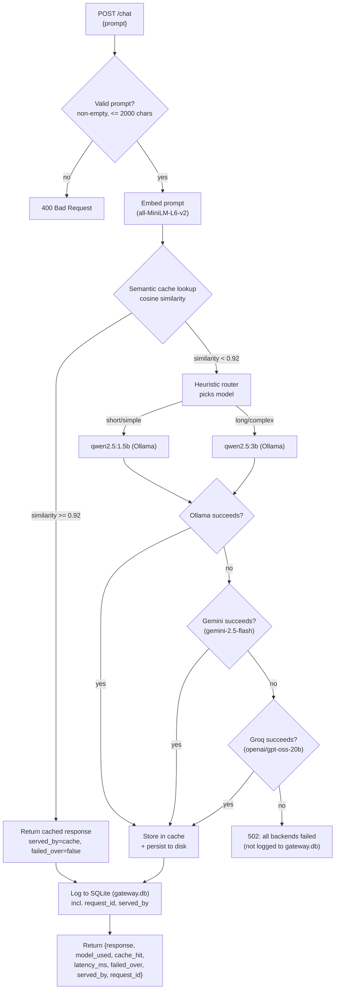

# LLM Gateway MVP

A local LLM gateway that routes prompts between two Ollama models by a heuristic, caches semantically similar prompts, and fails over through Gemini and then Groq if the local model call fails.

## What this is

This is a single FastAPI endpoint (`POST /chat`) sitting in front of two Ollama models running on my own machine: a small one (`qwen2.5:1.5b`) for simple prompts and a bigger one (`qwen2.5:3b`) for longer or more complex ones. Before calling either, it checks a semantic cache so a near-duplicate of a prompt it's already answered doesn't trigger another model call. If the routed local call fails or times out, it retries through a chain of cloud fallbacks — Gemini, then Groq — instead of just erroring out. Every request — hit, miss, or failover — gets logged to SQLite with a per-request ID, so the numbers in this README come from querying that log, not from memory. There's also a `GET /health` endpoint, basic input validation, and a cache that survives a restart.

## Why I built this

Most of the LLM-adjacent projects I've built (and seen other students build) are about what the model itself produces — a chatbot, a summarizer, something prompt-engineered. This one is about the layer underneath that: given more than one model to call, how do you decide which one handles a request, how do you avoid paying for the same generation twice, and what do you do when the thing you're calling doesn't answer. That's a different skill set from prompt work, closer to the serving/infrastructure side of ML systems, and I wanted something concrete to point to for it — an actual gateway I ran real requests through and can explain constant-by-constant, not a diagram of one I intend to build.

## Architecture



Cache hits skip the model call entirely and go straight to the log. Cache misses go through the router, then a three-tier failover chain — Ollama first, then Gemini, then Groq — stopping at the first success; Gemini and Groq are never routing options the heuristic picks on its own, only fallbacks for when Ollama's call actually fails. Every successful path, hit or miss, ends up logged before the response goes back; a request where all three backends fail is the one path that returns without being logged (see "Known limitations"). `GET /health` is a separate, lightweight endpoint that checks reachability of all three backends without going through any of this.

## Quick start

Tested on Windows with Python 3.13. On Mac/Linux, swap `venv\Scripts\...` for `venv/bin/...` and `copy` for `cp`.

**1. Install [Ollama](https://ollama.com) and pull both models this gateway routes between:**
```bash
ollama pull qwen2.5:1.5b
ollama pull qwen2.5:3b
```
Ollama should end up running on its default port (`localhost:11434`) — `ollama list` should show both models pulled.

**2. Clone this repo and set up a virtual environment:**
```bash
git clone https://github.com/amanjuneja420/llm-gateway.git
cd llm-gateway
python -m venv venv
venv\Scripts\pip install -r requirements.txt
```

**3. (Optional — only needed for cloud failover) set up API keys:**
```bash
copy .env.example .env
```
Edit `.env` and put real `GEMINI_API_KEY` / `GROQ_API_KEY` values in place of the placeholders. Without either, everything else works exactly the same — a failed local call just fails outright at that tier (with a clear "API_KEY is not set" error) instead of successfully failing over.

**4. Start the gateway:**
```bash
venv\Scripts\python -m uvicorn main:app --port 8000
```
First startup takes ~20–25 seconds while the embedding model loads into memory (and, if a cache was previously saved, while it's reloaded from disk). Leave this running in its own terminal. `curl http://localhost:8000/health` is a quick way to confirm all three backends are reachable.

**5. In a second terminal, run the benchmark:**
```bash
venv\Scripts\python benchmark.py
```
This fires 30 prompts at the running server and prints a summary: cache hit rate, average latency for hits vs. misses, and latency broken down by model. This is the script the numbers in "Results & verification" below actually came from.

**6. (Optional) Verify the failover chain:**
```bash
venv\Scripts\python test_failover.py
```
Covers a normal Ollama request, a cache hit, Ollama-fails-to-Gemini, and Ollama+Gemini-fail-to-Groq — see "Results & verification" for real output.

**7. (Optional) Deeper analysis, once `gateway.db` has some data in it:**
```bash
venv\Scripts\python analyze_ollama_stats.py       # load-time vs. generation-time breakdown per model
venv\Scripts\python aggregate_benchmark_runs.py   # combine multiple benchmark runs into one table
venv\Scripts\python cost_estimate.py              # what this token volume would cost on paid APIs
```

**8. (Optional, slow — ~35 minutes on CPU) generate the router evaluation set:**
```bash
venv\Scripts\python generate_eval_set.py
```
Runs 50 prompts through both models directly (bypassing the router) and writes `eval_set.csv` for manual quality judging — see "Results & verification".

## Project structure

- [`main.py`](main.py) — the FastAPI app: `POST /chat`, `GET /health`, request validation, request-ID tracing, and the failover chain, all wired together
- [`backends.py`](backends.py) — the `Backend` interface (`generate(prompt) -> BackendResponse`) and its three implementations: `OllamaBackend`, `GeminiBackend`, `GroqBackend`
- [`router.py`](router.py) — the heuristic model router (no I/O, pure function)
- [`cache.py`](cache.py) — the semantic cache (embedding + cosine similarity + disk persistence)
- [`db.py`](db.py) — SQLite schema + logging helper
- [`benchmark.py`](benchmark.py) — standalone load/test script, run manually against the live server
- [`test_failover.py`](test_failover.py) — standalone test script for the full three-tier failover chain
- [`analyze_ollama_stats.py`](analyze_ollama_stats.py) — breaks down Ollama's own load/eval timing per model from `gateway.db`
- [`aggregate_benchmark_runs.py`](aggregate_benchmark_runs.py) — combines several `benchmark.py` runs' printed summaries into one table with min/max/avg speedup and hit rate
- [`cost_estimate.py`](cost_estimate.py) — estimates what this project's real token volume would have cost on paid hosted APIs, versus $0 for local Ollama calls
- [`generate_eval_set.py`](generate_eval_set.py) — router evaluation harness: runs 50 prompts through both local models directly and writes [`eval_set.csv`](eval_set.csv) for manual quality judging (generation only — it does not judge)
- `runs/` — raw `gateway.db` snapshot from each `benchmark.py` run (`gateway_run_<UTC timestamp>.db`), archived automatically before the next run wipes the live `gateway.db`
- `gateway.db` — the committed SQLite log; currently a reference snapshot from one full benchmark run (Run 3, see below), kept so the results below are re-derivable rather than just asserted
- `.env` (not committed — see `.env.example`) — holds `GEMINI_API_KEY` and `GROQ_API_KEY`, loaded at startup via `python-dotenv`
- `cache_state.npz` / `cache_state.json` (not committed) — the semantic cache's persisted state, written after every new entry and reloaded on startup

## Design decisions

### The routing heuristic — and why it's a heuristic, not a trained model

`router.py` decides which model handles a prompt using two cheap, fully inspectable signals computed directly on the prompt text — no model, no training data, no learned weights:

1. **Word count** — prompts longer than `WORD_COUNT_THRESHOLD = 20` words are treated as "long" and routed to the bigger model. 20 was chosen by eyeballing example prompts: it's roughly where a prompt stops being a single simple question and becomes a paragraph-style, multi-clause request.
2. **Complexity keywords** — a fixed set (`explain`, `compare`, `contrast`, `steps`, `why`, `how does`, `difference between`, `pros and cons`, `analyze`, `summarize`, `evaluate`) that correlate with multi-step or open-ended reasoning tasks, catching short-but-hard prompts like "Why is the sky blue?" that word count alone would miss.

If either signal fires, the prompt goes to `qwen2.5:3b`; otherwise `qwen2.5:1.5b`.

**Why a heuristic instead of a trained classifier:** given the time I had, a heuristic is instant to run (no inference cost of its own), fully transparent (every routing decision can be explained by pointing at the exact line of code that made it), and needs zero training data or evaluation harness to trust. A trained router could route more accurately in principle, but that requires labeled examples of which model *should* have handled a given prompt, plus its own accuracy evaluation. I've since built the generation half of that evaluation harness (see Phase 4 under "Results & verification") — the labeled data doesn't exist yet, but the path to getting it does.

### The semantic cache, its similarity threshold, and persistence

`cache.py` embeds every prompt with `sentence-transformers/all-MiniLM-L6-v2`, keeps all `(embedding, prompt, response, model_used)` tuples in a plain Python list (no FAISS, no vector DB), and on each new prompt computes cosine similarity against every cached embedding with a single numpy dot product (embeddings are stored pre-normalized, so cosine similarity is just a dot product). If the best match scores at or above `SIMILARITY_THRESHOLD = 0.92`, that cached response is returned instantly and no model call is made.

**How 0.92 was chosen:** measured directly, not guessed. Using this exact embedding model:

| Prompt pair | Cosine similarity |
|---|---|
| "What is the capital of France?" vs "What's France's capital city?" (paraphrase) | 0.944 |
| "What is the capital of France?" vs "Can you tell me the capital of France" (paraphrase) | 0.934 |
| "What is the capital of France?" vs "What is the population of France?" (related, different question) | 0.709 |
| "What is the capital of France?" vs "What is the capital of Germany?" (related, different answer) | 0.663 |
| "What is the capital of France?" vs "How do I bake sourdough bread?" (unrelated) | 0.133 |

Genuine paraphrases land in the 0.93–0.95 range; the nearest "related but actually a different question" pairs land around 0.66–0.71. 0.92 sits comfortably in the gap between those two clusters — high enough that a subtly different question (different country, different attribute) won't incorrectly hit the cache, low enough that real paraphrasing reliably hits. It's a single named constant at the top of `cache.py`, so it's trivial to retune if more data suggests otherwise.

**Persistence:** `SemanticCache.save()`/`load()` write/read `cache_state.npz` (the embeddings, stacked into one matrix) and `cache_state.json` (the parallel prompt/response/model_used lists) — plain numpy and stdlib `json`, deliberately not `pickle`, since a corrupted or tampered pickle file can execute arbitrary code on load and these formats can't. The cache loads on startup and saves immediately after every new entry, not only on a clean shutdown — cross-process graceful shutdown signaling turned out to be unreliable on Windows during testing, and a shutdown-only save would lose everything on a crash anyway, which is the case that matters most. There's no size cap or eviction policy: it grows for as long as the process runs (see "Known limitations").

### Backend failover chain: Ollama → Gemini → Groq

The gateway tries three backends in a fixed order, stopping at the first success. `backends.py` defines a common `Backend` interface — `generate(prompt) -> BackendResponse` — implemented by `OllamaBackend`, `GeminiBackend`, and `GroqBackend`, so `main.py`'s `chat()` can loop over them without caring which one is actually answering beyond the name it reports back. This was originally two separate functions (`call_ollama()`, `call_gemini()`) directly in `main.py`; pulling them behind one interface was a deliberate refactor, done and verified as behavior-preserving *before* Groq was added on top of it.

**What counts as a "failure":** each tier's `generate()` call is wrapped in a bare `except Exception`, covering a timeout past that backend's own configured timeout, a connection failure, an HTTP error status, or anything else the call raises — "didn't produce a usable response" fails over regardless of the exact exception type. `OLLAMA_TIMEOUT_SECONDS = 120.0` is both the local timeout and, functionally, the original failover trigger threshold from before Groq existed.

**`served_by`** (`"ollama"` / `"gemini"` / `"groq"` / `"cache"`) records which backend actually answered a given request, logged as its own `gateway.db` column. `failed_over` is kept alongside it for backward compatibility with the simpler two-tier framing this started as — it's explicitly `served_by in ("gemini", "groq")`, true only when an actual backend failover occurred, and false for both `"ollama"` and `"cache"` (a cache hit is the healthy fast path, not a failover, and that's set explicitly rather than left to a default — see Phase 2's bug notes below for why that distinction mattered).

**This is deliberately not a circuit breaker.** There's no failure counter, no open/half-open/closed state, no cooldown window before trying Ollama again. Every request independently tries the local model first, then Gemini, then Groq; only that one request's own failures decide how far down the chain it falls. If Ollama recovers a millisecond later, the very next request goes straight back to it. A real circuit breaker (trip after N consecutive failures, stop even trying earlier tiers for a cooldown period, half-open probe requests) is more machinery than I built here — see "Known limitations".

**Why Groq, and why `openai/gpt-oss-20b` specifically:** Groq was queried live (`GET /openai/v1/models`) rather than assuming a model name — the list included speech-to-text and TTS models, input classifiers, Groq's own agentic `compound`/`compound-mini` wrapper (excluded: it can invoke tools on its own, unpredictable for a plain completions call), Qwen and Arabic-focused models, and the `openai/gpt-oss-*` family. `gpt-oss-20b` is the smallest/fastest plain instruction model in the list — this tier only gets exercised after Ollama *and* Gemini have both already failed for a request, so low latency matters more here than anywhere else in the chain. A real test call returned in ~39ms server-side.

**On API keys:** `GeminiBackend` sends its key via the `x-goog-api-key` header and `GroqBackend` via a `Bearer` token in `Authorization` — never as a URL query parameter for either. httpx exceptions (and anything that logs them) include the request URL in their message; a key-in-URL would leak the secret into ordinary error output the moment a call to that backend ever failed. A header never appears in that message.

## Results & verification

### Phase 1: health endpoint, request tracing, input validation, cache persistence

**`GET /health`** checks Ollama (a lightweight `/api/tags` call, not a generation) and each cloud backend (a models-list call) without touching the cache, router, or DB. Real output with all three backends up:
```
{"gateway":"up","ollama":"up","gemini":"up","groq":"up","cache_size":0}
```

**Request tracing:** a UUID (`request_id`) is generated once per request and threaded through the cache lookup, the failover chain, any `print()` emitted along the way, the DB row, and the response — the same value end to end. Verified for real: a request's `request_id` in its JSON response matched its `gateway.db` row exactly (`id=31`, same UUID, same prompt and model).

**Input validation:** an empty/whitespace-only prompt returns `400 {"detail":"prompt must not be empty or whitespace-only"}`; a prompt over `MAX_PROMPT_LENGTH = 2000` chars returns `400 {"detail":"prompt exceeds MAX_PROMPT_LENGTH (2000 chars)"}`. Both confirmed live against the running server.

**Cache persistence, tested against an actual crash, not just a clean restart:** sent a request, confirmed `cache_state.npz`/`.json` appeared on disk immediately, then **force-killed** the server process (simulating a crash, not a graceful shutdown) and restarted it. Startup log: `Loaded 1 cache entries from disk (cache_state.json/.npz)`. A paraphrase of the original prompt then returned `cache_hit: true` on the freshly restarted process — `model_used=cache, latency_ms=98.97` — with no new model call, proving the cache genuinely survived the restart rather than just the file existing.

### Phase 2: three-tier failover chain, and two real bugs it caught

[`test_failover.py`](test_failover.py) imports `main.py` directly (no live server needed) and monkeypatches specific backend instances' URLs to simulate failures without touching the real services. Real output from an actual run, covering all three tiers plus the cache-hit case:

```
=== Test 1: normal request through Ollama (should be unaffected) ===
PASS - model_used=qwen2.5:1.5b  cache_hit=False  served_by=ollama  failed_over=False  latency_ms=1936.4

=== Test: cache hit reports failed_over=False (it's the healthy fast path) ===
PASS - cache_hit=True  served_by=cache  failed_over=False  latency_ms=97.9

=== Test 2: Ollama fails -> Gemini succeeds ===
PASS - model_used=gemini-2.5-flash  served_by=gemini  failed_over=True  latency_ms=5415.7

=== Verifying served_by='gemini' was actually logged to gateway.db (test 2) ===
PASS - row id=34  model_used=gemini-2.5-flash  served_by=gemini  failed_over=1  latency_ms=5415.7

=== Test 3: Ollama AND Gemini both fail -> Groq succeeds ===
PASS - model_used=openai/gpt-oss-20b  served_by=groq  failed_over=True  latency_ms=7387.4

=== Verifying served_by='groq' was actually logged to gateway.db (test 3) ===
PASS - row id=35  model_used=openai/gpt-oss-20b  served_by=groq  failed_over=1  latency_ms=7387.4

============================================================
FAILOVER TEST SUMMARY
============================================================
  PASS   normal request (ollama)
  PASS   cache hit not failed_over
  PASS   gemini failover
  PASS   db logging (gemini)
  PASS   groq failover
  PASS   db logging (groq)
============================================================
```

The all-three-fail path was also verified manually: pointing all three backends at unreachable addresses for one request returned a clean `502` — `"All backends failed for this request: ollama (ConnectError); gemini (ConnectError); groq (ConnectError)"` — instead of a crash, with no `gateway.db` row written (see "Known limitations").

**Two real bugs this phase caught, not hypothetical ones:**
1. **The interface refactor silently broke the existing test's monkeypatch.** Before Groq was added, `call_ollama()`/`call_gemini()` were pulled into `backends.py`'s `OllamaBackend`/`GeminiBackend` as a "pure" refactor. `test_failover.py` used to simulate a failure by setting `main.OLLAMA_URL` to an unreachable address — after the refactor, that constant is only read once, at construction, by each `OllamaBackend` instance, so patching it afterward silently did nothing. Caught by actually re-running the existing tests before adding Groq, as planned, rather than assuming a "pure" refactor needed no re-verification. Fixed by patching the specific backend instance's `base_url` attribute instead.
2. **Schema migration only ran inside FastAPI's `lifespan`.** `init_db()`'s non-destructive `ALTER TABLE` migrations (for columns like `served_by`) normally run at server startup - but `test_failover.py` imports `main.py` directly and never triggers uvicorn's ASGI lifecycle, so the migration never ran and the first test run failed with `no column named served_by`. Fixed by having the test call `init_db()` itself, which is the more robust fix anyway: a test environment shouldn't depend on a real server having run first to have the right schema.

### Phase 3: cost estimation

[`cost_estimate.py`](cost_estimate.py) sums `eval_count` (tokens generated) across `gateway.db` and estimates what that volume would have cost on two reference paid APIs, versus the $0 this project actually paid running locally. Real output against the committed Run 3 snapshot:
```
Total tokens generated (eval_count)                      8,100
  served by local Ollama (actual cost: $0)               8,100
  served by cloud failover (Gemini/Groq)                     0
----------------------------------------------------------------
If ALL of this volume had instead gone to a paid API:

  OpenAI GPT-5.6 Luna                       $   0.0097
  Anthropic Claude Haiku 4.5                $   0.0405

  Local Ollama (what actually happened)     $   0.0000
```

**Both originally-planned reference models turned out to be stale when checked against live pricing pages**, the same "verify, don't assume" lesson as the Gemini/Groq model selections above: `GPT-4o-mini` no longer appears in OpenAI's pricing tables at all (only a passing legacy footnote), replaced with `GPT-5.6 Luna` — the cheapest model in OpenAI's current flagship table (source: `developers.openai.com`, checked 2026-09-08). `Claude Haiku 3.5` is listed on Anthropic's own pricing page as "retired, except on Bedrock and Google Cloud", replaced with the current `Claude Haiku 4.5` (source: `platform.claude.com/en/docs/about-claude/pricing`, checked 2026-09-08). This is explicitly a hardcoded, illustrative snapshot, not a live pricing integration — it will go stale again, and only accounts for output-token cost since `gateway.db` never logs prompt/input token counts, so it's a floor on the real bill, not a full one.

### Phase 4: router evaluation harness (generation step)

[`generate_eval_set.py`](generate_eval_set.py) bypasses `router.py` entirely and runs both `qwen2.5:1.5b` and `qwen2.5:3b` directly on the same 50 prompts — 20 deduplicated unique questions from `benchmark.py`'s 30-prompt set (its paraphrase groups exist to test the cache, not model quality, so only one phrasing per question was kept) plus 30 new prompts spanning domains `benchmark.py` doesn't touch (math, biology, CS/data structures, economics, literature). Output is [`eval_set.csv`](eval_set.csv): `prompt`, `response_1.5b`, `response_3b`, and an empty `which_is_better` column.

Real evidence from an actual run, in [`eval_generation.log`](eval_generation.log): all 50 prompts × 2 models = 100 real generations succeeded (zero errors), taking **34.7 minutes (2081s) total** on this CPU-only machine — individual `qwen2.5:3b` calls ran up to 103 seconds. Confirmed before committing: `which_is_better` is empty on all 50 rows. This script only generates; **judging which model answered better, by hand, is separate work not done by this script or by me** — see "What I'd build next".

## Known limitations

- **A request where all three backends fail is not logged anywhere.** The `502` path in `chat()` returns before calling `log_request()` — confirmed both by code inspection and by a live test with all three backends pointed at unreachable addresses (no `gateway.db` row was written). Every other outcome (cache hit, any successful tier, even a 400 from validation happening before this point) either logs or was never a "the system tried and failed" event in the first place; this one specific path is the exception, stated here rather than implied away.
- **The semantic cache has no size cap or eviction policy.** Persistence (see "Design decisions") means it also no longer resets on restart, which is progress, but the trade-off is that it now grows unbounded for as long as it keeps getting new entries — nothing prunes old or rarely-hit entries.
- **Runs A, B, 1, and 2 (of the original 5-run benchmark set) have no preserved raw database.** The archiving mechanism (`runs/gateway_run_<timestamp>.db`) didn't exist yet when those were executed, so their numbers are transcribed from that session's printed summaries/logs, not re-derivable from a raw `gateway.db`. Every benchmark run from Run 3 onward is fully re-derivable from raw per-request rows instead.
- **Everything was measured on one CPU-only machine** (Intel integrated graphics, no CUDA). The routing split and cache speedup direction should generalize; the absolute millisecond numbers are specific to this hardware and clearly move around with background load even on this one machine (see the benchmark's 400x–780x spread).
- **The router is still a heuristic, not a trained model.** The generation half of an evaluation harness now exists (`eval_set.csv`, 50 prompts x both models) but the labeled judging data doesn't yet — see "What I'd build next".
- **No rate limiting.** Nothing stops one client from firing requests as fast as the CPU (or Gemini's/Groq's own rate limits) will allow.
- **The failover chain is a simple ordered retry, not a circuit breaker** — no failure counter, no cooldown, no half-open state. It only ever reacts to the one request in front of it, at every tier.
- **No Docker, Kubernetes, or deployment/CI-CD setup**, and no load balancing across multiple local model replicas. These were left out deliberately rather than forgotten — this was a time-boxed solo project, and I don't have hands-on deployment experience I could back up in an interview yet if asked to defend those choices.

## What I'd build next

- Rate limiting
- SSE streaming for the `/chat` response
- Manually judge `eval_set.csv` (which model answered better per prompt — "1.5b", "3b", or "tie"), then train a routing classifier on the result. The generation half is done; the judging and the classifier itself are still pending.
- A small dashboard over `gateway.db` instead of querying it by hand
